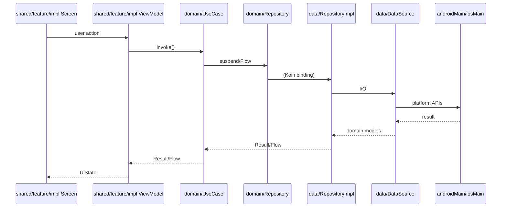
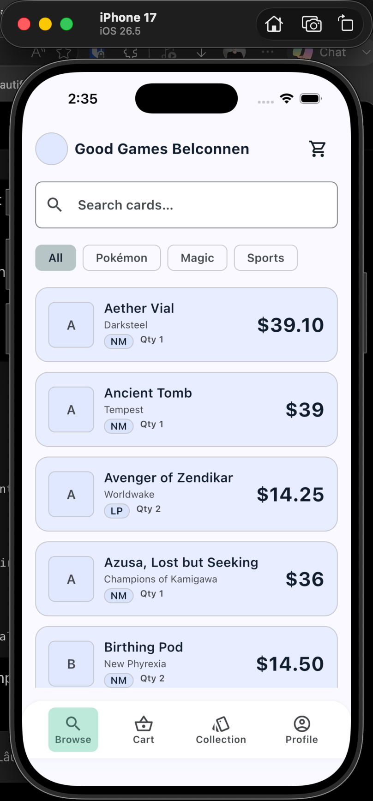
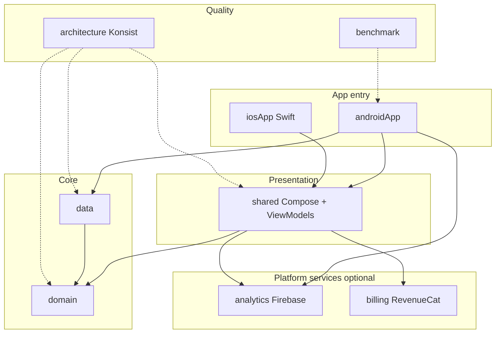

**What is in place today:**

- Kotlin Multiplatform (Android + iOS) with enforced module boundaries (`domain` ← `data` ← app DI; `shared` → `domain` + optional platform facades)
- Shared Compose Multiplatform UI, ViewModels, and Flow-based UDF — features live under `shared/.../feature/<name>/{api,impl}/`
- Reference app shell: splash → onboarding → main tabs (Browse, Collection, Settings, card detail, legal, app promotion)
- **Browse** uses **Paging 3 + Room + RemoteMediator** via a presentation port (`BrowseCardPagerFactory`) bound at app entry — see [docs/browse-paging-flow.md](docs/browse-paging-flow.md)
- Optional standalone KMP modules: [`:analytics`](analytics/README.md) (Firebase Analytics + Crashlytics) and [`:billing`](billing/README.md) (RevenueCat IAP)
- Ktor networking, Room KMP persistence, and Koin DI wired at app entry points
- Quality automation: Spotless, Detekt, Android Security Lint, Konsist architecture tests, Kover, optional SonarQube, baseline profiles / macrobenchmarks
- **Security on commit:** local [pre-commit](https://pre-commit.com/) hooks — **Gitleaks** scans staged content and **blocks** commits on secrets; **Snyk** warns on high+ dependency issues (non-blocking). Setup: [Local commit hooks](#local-commit-hooks-pre-commit). CI-style verification: `./gradlew qualityCheck`.

**Still in progress** (template is actively evolving; not every roadmap item ships yet):

- Deep links and navigation edge cases
- Environment configuration for **dev / staging / prod** (build flavors, secrets via env / gitignored local files — not committed)
- Native UI bridges (`expect`/`actual` or platform views where Compose Multiplatform is not enough)
- Guardrail scripts for agent loops and other items in [Roadmap](#roadmap)

**Recommended review path:**

1. Read [AGENTS.md](AGENTS.md) and [docs/kmp-feature-playbook.md](docs/kmp-feature-playbook.md) — how agents and humans are expected to add features.
2. Skim [Project structure](#project-structure) and the [Modules](#modules) table, then walk `domain/` → `data/` → `shared/feature/`.
3. For Firebase or RevenueCat, read [analytics/README.md](analytics/README.md) and [billing/README.md](billing/README.md).
4. Run `./gradlew qualityCheck` for formatting, lint, tests, and architecture rules.
5. Optionally install pre-commit (`./scripts/setup-pre-commit.sh --baseline`) and skim [`.pre-commit-config.yaml`](.pre-commit-config.yaml) for commit-time security.

---

## Flow diagram



Browse paging follows a parallel path: `BrowseViewModel` → `BrowseCardPagerFactory` (port in `shared/feature/browse/api`) → `BrowseCardPagerFactoryImpl` (in `data`), bound at app entry via `browsePagingModule`. See [docs/browse-paging-flow.md](docs/browse-paging-flow.md).


---

# Screenshots




# CMPTemplate

Kotlin Multiplatform template for **Android** and **iOS** that demonstrates **Clean Architecture**: a pure `domain` layer, a `data` layer for persistence and networking, a `shared` Compose Multiplatform presentation layer, and optional **platform service** modules (`:analytics`, `:billing`) that sit beside the core stack. Dependency injection is wired at the app entry points, and layer boundaries are enforced with Konsist tests.

The included **reference app** is a Stitch-inspired collectible-card shell ([`MainScreen`](shared/src/commonMain/kotlin/com/devindie/cmptemplate/feature/main/MainScreen.kt)): splash and onboarding, then bottom-nav tabs for **Browse** (paged catalog with search and filters), **Collection**, **Settings**, plus card detail, legal documents, and in-app review promotion. Most features flow **ViewModel → use case → repository**; Browse paging uses a **`BrowseCardPagerFactory` port** in `shared` with `BrowseCardPagerFactoryImpl` in `data`, bound via `browsePagingModule` at startup. Local catalog data lives in **Room**; remote sync uses **Ktor** (with a fake remote source for offline development).

**What you get**

- Feature packages under `shared/.../feature/<name>/{api,impl}/` with Koin modules registered in [`AppDomainModule`](shared/src/commonMain/kotlin/com/devindie/cmptemplate/core/di/AppDomainModule.kt)
- UDF ViewModels and Compose Multiplatform screens shared across platforms
- Optional `:analytics` and `:billing` facades (Firebase, RevenueCat) — integration guides in each module's README
- Koin modules split between domain (shared), platform `data` bindings, and app-layer service init (Android `Application`, iOS `doInitKoin`)
- `./gradlew qualityCheck` — formatting, Detekt, **Android Security Lint**, unit tests (`:domain`, `:data`, `:analytics`, `:billing`, `:shared`), and architecture rules
- Optional local **SonarQube** + **Kover** coverage upload

## Architecture at a glance



**Dependency direction:** `domain` ← `data` ← app DI; `shared` → `domain` + optional `:analytics` / `:billing` (service facades, not repository implementations). iOS `shared` `iosMain` also links `:data` solely for Koin bootstrap and paging module wiring — not for direct `data` imports in screens or ViewModels.

Feature implementation guide: [docs/kmp-feature-playbook.md](docs/kmp-feature-playbook.md).

## Modules

| Module / path | Role |
|---------------|------|
| [`:domain`](domain/) | Pure Kotlin models, repository interfaces, use cases (`carddetail`, `onboarding`, `settings`, `startup`, `user`) |
| [`:data`](data/) | Room (`BrowseDatabase`), Ktor client, `*RepositoryImpl`, platform DataSources, `BrowseCardPagerFactoryImpl`, `platformDataModule()` |
| [`:shared`](shared/) | Compose Multiplatform UI, `core/` (DI, navigation, theme), `feature/*/{api,impl}/` ViewModels and screens |
| [`:analytics`](analytics/) | Standalone Firebase Analytics + Crashlytics facade; public `AnalyticsClient` API — [analytics/README.md](analytics/README.md) |
| [`:billing`](billing/) | Standalone RevenueCat IAP facade; public `BillingClient` API — [billing/README.md](billing/README.md) |
| [`:androidApp`](androidApp/) | Android application, `platformDataModule()`, Firebase/Billing init, baseline profile consumer |
| [`iosApp/`](iosApp/) | Xcode project, `Shared` framework, `KotlinMultiplatformLinkedPackage` (SPM linkage for Firebase), iOS Koin init |
| [`:architecture`](architecture/) | Konsist JVM tests enforcing layer, package, and feature api/impl boundaries |
| [`:benchmark`](benchmark/) | Baseline profile generator and startup macrobenchmarks for `:androidApp` |
| [`store/`](store/) | App Factory store listing pipeline — metadata, screenshots, validate, internal release; see [store/README.md](store/README.md) |
| [`maestro/`](maestro/) | YAML E2E flows (Browse search, filters, pagination, detail) — [maestro/README.md](maestro/README.md) |
| [`scripts/`](scripts/) | Bootstrap generator, pre-commit setup, store capture helpers |

Dependency injection is wired at the app layer: `androidApp` and iOS `doInitKoin` supply `platformDataModule()`, `browsePagingModule`, and optional `analyticsFeatureModule` / `billingFeatureModule`. Presentation code must not import `data` types or `*RepositoryImpl` — enforced by Konsist.

## Project structure

```
cmp-template/
├── domain/                 # models/, repository/, usecase/ — no Android, Compose, Ktor, or Koin
├── data/                   # source/local|remote/, network/, di/, coroutines/
├── shared/
│   └── src/commonMain/.../
│       ├── core/           # AppDomainModule, navigation shell, theme, shared UI
│       └── feature/        # one folder per feature, each with api/ + impl/
│           ├── browse/     # paged catalog (BrowseCardPagerFactory port)
│           ├── carddetail/
│           ├── collection/
│           ├── main/       # bottom-nav shell + tab NavHost
│           ├── onboarding/
│           ├── settings/
│           ├── splash/
│           ├── legal/
│           └── apppromotion/
├── analytics/              # api/ + impl/ — Firebase default, NoOp when disabled
├── billing/                # api/ + impl/ — RevenueCat default, NoOp when disabled
├── androidApp/             # Application, MainActivity, google-services.json
├── iosApp/                 # Xcode project + KotlinMultiplatformLinkedPackage/
├── architecture/           # Konsist boundary tests
├── benchmark/              # baseline profiles + macrobenchmarks
├── docs/                   # playbooks, paging flow, superpowers specs
├── maestro/                # E2E YAML flows
├── store/                  # Play / App Store metadata pipeline
├── scripts/                # bootstrap-app.sh, pre-commit, store helpers
└── gradle/libs.versions.toml
```

Per-feature notes live next to the code, e.g. [`shared/.../feature/browse/README.md`](shared/src/commonMain/kotlin/com/devindie/cmptemplate/feature/browse/README.md).

## Technologies

Pinned versions live in [`gradle/libs.versions.toml`](gradle/libs.versions.toml) (Kotlin **2.3.21**, Compose Multiplatform **1.11.0**, AGP **9.0.1**, `minSdk` **24**, `compileSdk` / `targetSdk` **36**).

### Core & build

- [Kotlin Multiplatform](https://kotlinlang.org/docs/multiplatform.html) with the Compose Compiler plugin
- [Android Gradle Plugin](https://developer.android.com/build) 9

### UI

- [Compose Multiplatform](https://www.jetbrains.com/lp/compose-multiplatform/) — Material 3, resources, previews
- [Navigation Compose](https://www.jetbrains.com/help/kotlin-multiplatform-dev/compose-navigation-routing.html) (typed routes)
- [Lifecycle](https://developer.android.com/jetpack/androidx/releases/lifecycle) ViewModel + `lifecycle-runtime-compose` (`collectAsStateWithLifecycle` in screens)

### Domain & async

- [Kotlin Coroutines](https://github.com/Kotlin/kotlinx.coroutines) — `StateFlow`, structured concurrency in ViewModels and data
- Pure `domain` module (no Android, Compose, Ktor, or Koin — verified by Konsist)

### Data

- [Room](https://developer.android.com/kotlin/multiplatform/room) (KMP) + KSP + [bundled SQLite](https://developer.android.com/jetpack/androidx/releases/sqlite)
- [AndroidX Paging 3](https://developer.android.com/topic/libraries/architecture/paging/v3-overview) — Browse catalog (`RemoteMediator` + Room `PagingSource`); port/impl split documented in [docs/browse-paging-flow.md](docs/browse-paging-flow.md)
- [Ktor](https://ktor.io/) client — OkHttp on Android, Darwin on iOS; kotlinx.serialization JSON
- [ksafe](https://github.com/ioannisa/KSafe) for sensitive field handling in the data layer

### Platform services (optional modules)

- [`:analytics`](analytics/README.md) — Firebase Analytics + Crashlytics (Android Gradle plugins + GitLive on iOS; SPM via `swiftPMDependencies`)
- [`:billing`](billing/README.md) — RevenueCat [`purchases-kmp-core`](https://www.revenuecat.com/docs/getting-started/installation/kotlin-multiplatform) on Android and iOS

### Dependency injection

- [Koin](https://insert-koin.io/) — `koin-core`, `koin-compose-viewmodel`, Android bindings in `androidApp` / `data`; `analyticsFeatureModule` / `billingFeatureModule` at app entry

### Testing

- [kotlin-test](https://kotlinlang.org/api/latest/kotlin.test/) in KMP `commonTest`
- [Turbine](https://github.com/cashapp/turbine) for Flow / `StateFlow` assertions in `:shared`
- [JUnit 5](https://junit.org/junit5/) + [Konsist](https://docs.konsist.lemonappdev.com/) in `:architecture`

Details: [docs/testing.md](docs/testing.md).

### Android (`:androidApp` only)

- [Android Security Lint](https://developer.android.com/google/play/integrity/security-lint) (`com.android.security.lint:lint` **1.0.4**) — bundled via `lintChecks` in [`androidApp/build.gradle.kts`](androidApp/build.gradle.kts); runs with AGP **Lint** on the app module (TLS, WebView, permissions, and related checks from Google’s security rule set)

### Version catalog only (not wired yet)

[Coil 3](https://github.com/coil-kt/coil) is declared in the catalog (`coil-compose`, `coil-network-ktor`) but not added to module dependencies yet. See [Roadmap](#roadmap).

## Code analysis & quality

| Tool | Purpose | How to run |
|------|---------|------------|
| **Spotless** + ktlint | Format Kotlin and Gradle scripts | `./gradlew spotlessCheck` / `spotlessApply` |
| **Detekt** | Static analysis ([`detekt.yml`](detekt.yml); Compose rules via `detekt-compose`) | `./gradlew detektAll` (part of `qualityCheck`) |
| **Android Security Lint** | Google security checks on `:androidApp` (via `lintChecks`) | `./gradlew :androidApp:lint` (part of `qualityCheck`); HTML report under `androidApp/build/reports/` |
| **Konsist** | Clean Architecture boundaries (layers, imports, repositories) | `./gradlew :architecture:test` |
| **Kover** | Unit-test coverage XML (feeds Sonar) | `./gradlew koverXmlReport` |
| **qualityCheck** | Full gate: Spotless + Detekt + `:androidApp:lint` + `:domain` / `:data` / `:analytics` / `:billing` / `:shared` tests + Konsist | `./gradlew qualityCheck` |
| **SonarQube** (Docker) | Dashboard analysis + coverage upload | See [SonarQube (local)](#sonarqube-local) below |
| **CodeGraph** | Tree-sitter knowledge graph for symbols, callers, and impact | Cursor MCP in [`.cursor/mcp.json`](.cursor/mcp.json); run `codegraph init -i` if `.codegraph/` is missing; see [AGENTS.md](AGENTS.md) |
| **`:benchmark`** | Baseline profiles and startup macrobenchmarks | Device required; see [Benchmarks](#benchmarks) below |
| **Compose Compiler Reports** | Per-composable stability diagnostics (`:shared` UI) | `./gradlew composeCompilerReports` — see [Compose Compiler Reports](#compose-compiler-reports) below |
| **pre-commit** (Gitleaks + Snyk) | Secret scan (blocks commit) + Snyk dependency warnings (high+, does not block) | See [Local commit hooks](#local-commit-hooks-pre-commit) below |

**When to use what:** formatting → Spotless; Kotlin smells → Detekt; Android security / manifest / API misuse → `:androidApp:lint` (Security Lint rules); layer violations → Konsist; coverage and duplication trends → Sonar; call-graph exploration in the IDE → CodeGraph; Compose recomposition / unstable parameters → `composeCompilerReports`; secrets and dependency CVEs before commit → pre-commit.

### Compose Compiler Reports

On-demand diagnostics for Compose Multiplatform UI stability in `:shared`. Compiles the module, emits the Kotlin Compose Compiler report, and writes a filtered summary with **non-skippable** and **unstable-parameter** composables listed first.

```bash
./gradlew composeCompilerReports
```

Reports are written under [`shared/build/compose_compiler/`](shared/build/compose_compiler/):

| File | Purpose |
|------|---------|
| `shared-composables.txt` | Raw per-composable stability dump from the compiler |
| `shared-classes.txt` | Per-class stability (why a type is stable or unstable) |
| `unstable-composables-summary.txt` | Grouped summary: non-skippable → unstable params → unknown stability → fully stable |
| `unstable-composables-first.txt` | Full composables report reordered with unstable entries at the top |

`:shared` enables report generation via `composeCompiler { reportsDestination = … }` in [`shared/build.gradle.kts`](shared/build.gradle.kts). Third-party types can be opted in through [`shared/stability_config.conf`](shared/stability_config.conf). For CI baseline checks, `:shared` also applies the [Compose Stability Analyzer](https://github.com/skydoves/compose-stability-analyzer) plugin (`stabilityDump` / `stabilityCheck`).

Use this when investigating scroll jank, unexpected recompositions, or whether a composable parameter blocks skipping. It is not part of `qualityCheck`.

### Local commit hooks (pre-commit)

Runs automatically on `git commit` (complements `./gradlew qualityCheck`, which does not run at commit time).

| Tool | Install | Auth |
|------|---------|------|
| **pre-commit** | `brew install pre-commit` or `pip install pre-commit` | Python 3.9+ |
| **gitleaks** | Bundled by the hook on first run; optional `brew install gitleaks` for manual runs | None |
| **snyk** | `brew install snyk-cli` or `npm install -g snyk` | `snyk auth` once, or `SNYK_TOKEN` in your shell profile |

**One-time setup (per machine and clone):**

```bash
# Automated (installs Homebrew deps, hooks, Gitleaks env; optional baseline)
snyk auth
./scripts/setup-pre-commit.sh --install-deps --baseline

# Minimal (tools already installed)
./scripts/setup-pre-commit.sh --baseline
```

See `./scripts/setup-pre-commit.sh --help` for options (`--install-deps`, `--baseline`, `--skip-snyk-check`).

**Every commit:** Gitleaks scans **staged file contents** and **blocks** the commit on findings (via [`scripts/gitleaks-pre-commit.sh`](scripts/gitleaks-pre-commit.sh); the stock hook misses many staged secrets). Snyk runs `snyk test --all-projects --severity-threshold=high` and prints **warnings only** — vulnerabilities do not block the commit (fix before push/PR).

**Manual runs:** `pre-commit run` · `pre-commit run gitleaks --all-files` · `bash scripts/snyk-pre-commit.sh`

**If Gitleaks fails:** remove or rotate the secret; use env vars / gitignored `local.properties` instead. **If Snyk warns:** upgrade deps in [`gradle/libs.versions.toml`](gradle/libs.versions.toml) per Snyk output. Use `git commit --no-verify` only as an escape hatch for Gitleaks false positives or offline work.

Config: [`.pre-commit-config.yaml`](.pre-commit-config.yaml), [`.gitleaks.toml`](.gitleaks.toml).

## Build & run

**Prerequisites:** Android SDK path in `local.properties` (see [`local.properties.example`](local.properties.example)). Docker optional (SonarQube only).

### Bootstrap a new app (fresh git history)

Copy this template into a new directory with renamed package, app IDs, Kotlin source trees, Maestro/store config, and Konsist roots — then `git init` with a single initial commit. The template repo is not modified.

```bash
./scripts/bootstrap-app.sh \
  --package com.acme.myvault \
  --display-name "My Vault" \
  --output-dir ../my-vault
```

| Flag | Purpose |
|------|---------|
| `--dry-run` | Preview derived names and transform counts |
| `--force` | Replace an existing output directory |
| `--no-git` | Skip `git init` / initial commit |
| `--verify` | Run `./gradlew qualityCheck` in the output directory |

After bootstrap: `cp local.properties.example local.properties`, set `sdk.dir`, run `./gradlew qualityCheck`. Replace Firebase placeholders (`androidApp/google-services.json`, `iosApp/iosApp/GoogleService-Info.plist`) before release.

Design: [docs/superpowers/specs/2026-06-27-app-bootstrap-generator-design.md](docs/superpowers/specs/2026-06-27-app-bootstrap-generator-design.md).

```bash
# Android debug APK
./gradlew :androidApp:assembleDebug

# Full verification gate
./gradlew qualityCheck

# Architecture rules only
./gradlew :architecture:test

# Android Lint + Security Lint checks only (HTML under androidApp/build/reports/)
./gradlew :androidApp:lint
```

**iOS:** Open [`iosApp/iosApp.xcodeproj`](iosApp/iosApp.xcodeproj) in Xcode. Build the shared KMP framework via Gradle as needed before running on a simulator or device (standard KMP iOS workflow).

### Benchmarks

Requires a connected device or emulator. Instrumented tests in `:benchmark` target `:androidApp` (baseline profile collection and startup macrobenchmarks):

```bash
# Baseline profile collection (BaselineProfileGenerator)
./gradlew :benchmark:connectedNonMinifiedBenchmarkAndroidTest

# Startup / scroll macrobenchmarks (StartupBenchmarks)
./gradlew :benchmark:connectedBenchmarkBenchmarkAndroidTest
```

### SonarQube (local)

Requires Docker. Copy `local.properties.example` → `local.properties` and set `SONAR_TOKEN` after first login. Coverage comes from Kover (`koverXmlReport` runs as part of `sonarAnalysis`).

```bash
./gradlew sonarUp              # start SonarQube + PostgreSQL (http://localhost:9000)
./gradlew sonarAnalysis        # tests + Kover report + upload (server must be running)
./gradlew sonarLocalAnalysis   # sonarUp → wait → sonarAnalysis
./gradlew sonarDown            # stop containers (data kept in Docker volumes)
```

## Roadmap

Planned work not implemented in the template yet:

| # | Item | Scope |
|---|------|--------|
| 1 | ~~**Paging 3 on Browse**~~ | **Done** — `BrowseCardPagerFactory` port in `shared`, `BrowseCardPagerFactoryImpl` + `RemoteMediator` in `data`, `LazyPagingItems` in [`BrowseScreen`](shared/src/commonMain/kotlin/com/devindie/cmptemplate/feature/browse/impl/BrowseScreen.kt); see [docs/browse-paging-flow.md](docs/browse-paging-flow.md) |
| 2 | **Project guardrail automation** | Script(s) under `scripts/` to run `qualityCheck` and `sonarAnalysis` locally, aggregate reports (Detekt, Lint HTML, Kover, Sonar), and support an agent loop: run → parse failures → prompt AI fix → re-run until green or max iterations |
| 3 | ~~**Template generator script**~~ | **Done** — [`scripts/bootstrap-app.sh`](scripts/bootstrap-app.sh) copies the repo, renames package/IDs, moves Kotlin trees, and inits fresh git; see [Bootstrap a new app](#bootstrap-a-new-app-fresh-git-history) |
| 4 | **Coil image loading** | Wire catalog `coil-compose` + `coil-network-ktor` for card thumbnails and detail art in Browse / Collection |
| 5 | **Native UI via expect/actual** | Add reusable platform UI in `:shared` (`commonMain` `@Composable expect` or wrapper API + `androidMain` / `iosMain` `actual` implementations), following existing patterns such as [`AppWindowInsets`](shared/src/commonMain/kotlin/com/devindie/cmptemplate/core/ui/insets/AppWindowInsets.kt); use for views Compose Multiplatform does not cover (e.g. `UIKit`/`AndroidView` bridges, platform pickers, maps). Keep `domain`/`data` expect/actual for I/O only — see [docs/kmp-feature-playbook.md](docs/kmp-feature-playbook.md) Step 0 |
| 6 | **Store publishing pipeline** | Metadata, Maestro screenshot capture, validation, Fastlane upload to Play internal + TestFlight — [store/README.md](store/README.md), design [docs/superpowers/specs/2026-06-26-store-publishing-pipeline-design.md](docs/superpowers/specs/2026-06-26-store-publishing-pipeline-design.md) |

Contributions should follow [docs/kmp-feature-playbook.md](docs/kmp-feature-playbook.md) and keep `qualityCheck` green.

## Documentation

- [docs/kmp-feature-playbook.md](docs/kmp-feature-playbook.md) — adding features layer by layer
- [docs/browse-paging-flow.md](docs/browse-paging-flow.md) — Browse paging port/impl and RemoteMediator
- [analytics/README.md](analytics/README.md) — Firebase Analytics + Crashlytics integration
- [billing/README.md](billing/README.md) — RevenueCat IAP integration
- [docs/testing.md](docs/testing.md) — module test map, fakes, Turbine
- [docs/coroutines-conventions.md](docs/coroutines-conventions.md) — dispatchers and `runTest`
- [docs/code-documentation.md](docs/code-documentation.md) — KDoc conventions
- [AGENTS.md](AGENTS.md) — conventions and tooling summary for coding agents


## External tools reference

Third-party **tools** wired into this repo (not runtime app libraries such as Ktor, Room, or Koin). Each row is scoped to a single concern — avoid duplicating the same check across tools.

### Security

| Tool | What | Why |
|------|------|-----|
| **[Gitleaks](https://github.com/gitleaks/gitleaks)** | Scans staged git content for secrets | **Blocks commits** on findings; custom [`scripts/gitleaks-pre-commit.sh`](scripts/gitleaks-pre-commit.sh) catches cases the stock hook misses |
| **[Snyk Open Source](https://snyk.io/)** | Scans Gradle dependencies for CVEs | Warns on **high+** severity before push; **non-blocking** via [`scripts/snyk-pre-commit.sh`](scripts/snyk-pre-commit.sh) |
| **[pre-commit](https://pre-commit.com/)** | Runs Gitleaks + Snyk on every `git commit` | One-time setup with [`scripts/setup-pre-commit.sh`](scripts/setup-pre-commit.sh); config in [`.pre-commit-config.yaml`](.pre-commit-config.yaml) |
| **[Android Security Lint](https://github.com/google/android-security-lints)** | Google security rule set on `:androidApp` | Catches TLS, WebView, permission, and related misuse at lint time (`lintChecks` in `androidApp/build.gradle.kts`) |
| **[KSafe](https://github.com/ioannisa/KSafe)** | Marks and handles sensitive fields in the data layer | Defense-in-depth alongside secret scanning |

### Code quality & static analysis

| Tool | What | Why |
|------|------|-----|
| **[Spotless](https://github.com/diffplug/spotless)** + **ktlint** | Formats Kotlin and Gradle scripts | Consistent style; part of `qualityCheck` |
| **[Detekt](https://detekt.dev/)** (+ [detekt-compose](https://github.com/mrmans0n/compose-rules)) | Kotlin static analysis and Compose rules | Catches complexity and maintainability issues; config in [`detekt.yml`](detekt.yml) |
| **[Konsist](https://docs.konsist.lemonappdev.com/)** | JVM tests for package/import/layer rules | **Fails the build** if Clean Architecture boundaries break (`:architecture`) |
| **AGP Lint** | Standard Android lint on `:androidApp` | Manifest, API, and resource correctness; includes Security Lint above |
| **[SonarQube Community](https://www.sonarsource.com/open-source-editions/)** (local Docker) | Dashboard for bugs, smells, duplication, coverage trends | Optional deeper analysis at `http://localhost:9000` |
| **Sonar Gradle plugin** | Uploads analysis + Kover XML to Sonar | `./gradlew sonarAnalysis` / `sonarLocalAnalysis` |
| **Docker Compose** + **PostgreSQL 16** | Local SonarQube stack | `./gradlew sonarUp` / `sonarDown`; see [`docker-compose.yml`](docker-compose.yml) |
| **[Kover](https://github.com/Kotlin/kotlinx-kover)** | Unit-test coverage XML | Feeds Sonar; `./gradlew koverXmlReport` |
| **`qualityCheck`** (Gradle aggregate) | Spotless → Detekt → Lint → `:domain` / `:data` / `:analytics` / `:billing` / `:shared` tests → Konsist | Single pre-PR gate: `./gradlew qualityCheck` |

### Compose / UI performance diagnostics

| Tool | What | Why |
|------|------|-----|
| **Compose Compiler Reports** (custom Gradle task) | Per-composable stability dumps for `:shared` | Find non-skippable composables and unstable parameters; `./gradlew composeCompilerReports` |
| **[Compose Stability Analyzer](https://github.com/skydoves/compose-stability-analyzer)** (Skydoves) | `stabilityDump` / `stabilityCheck` on `:shared` | Baseline stability regressions; config in [`shared/stability_config.conf`](shared/stability_config.conf) |

Not part of `qualityCheck` — run when investigating scroll jank or recomposition issues.

### Testing

| Tool | What | Why |
|------|------|-----|
| **[kotlin-test](https://kotlinlang.org/api/latest/kotlin.test/)** | Assertions in KMP `commonTest` | Shared unit tests on JVM and iOS simulator targets |
| **[JUnit 5](https://junit.org/junit5/)** | JVM test runner in `:architecture` | Runs Konsist boundary tests |
| **[Turbine](https://github.com/cashapp/turbine)** | Asserts `Flow` / `StateFlow` emissions | ViewModel tests for debounce, connectivity, pagination |
| **Ktor MockEngine** | Fake HTTP in data-layer tests | Test repositories without a real server |
| **[Robolectric](https://robolectric.org/)** | JVM Android environment in `:shared` host tests | Lightweight Android-specific tests without a device |
| **[Maestro](https://maestro.mobile.dev/)** | YAML E2E flows for Browse (search, filter, pagination, detail) | Real-device journeys; see [`maestro/README.md`](maestro/README.md) |
| **Maestro MCP** | IDE agent tools (`inspect_screen`, `run`, screenshots) | Agent-driven E2E iteration; configured in [`.cursor/mcp.json`](.cursor/mcp.json) |

Maestro is **not** part of `qualityCheck`. Details: [docs/testing.md](docs/testing.md).

### Performance (Android)

| Tool | What | Why |
|------|------|-----|
| **[Baseline Profile](https://developer.android.com/topic/performance/baselineprofiles)** (AndroidX plugin) | Collects hot paths into `baseline.prof` | Faster cold start and first scroll |
| **[Macrobenchmark](https://developer.android.com/topic/performance/benchmarking/macrobenchmark-overview)** (`:benchmark`) | Instrumented startup/scroll benchmarks | Validates baseline profile impact on a device |
| **UI Automator** + AndroidX Test | Drives the app during benchmark runs | Required for macrobenchmark instrumentation |

See [Benchmarks](#benchmarks) above.

### AI / agent & developer workflow

| Tool | What | Why |
|------|------|-----|
| **CodeGraph** (CLI + MCP) | Tree-sitter knowledge graph: symbols, callers, impact | Fast structural queries for agents and humans; Cursor MCP in [`.cursor/mcp.json`](.cursor/mcp.json); run `codegraph init -i` if `.codegraph/` is missing |
| **OpenSpec** | Spec-driven propose → implement → archive workflow | Structured AI feature changes; [`openspec/config.yaml`](openspec/config.yaml) |
| **[AGENTS.md](AGENTS.md)** + Cursor rules/skills | Conventions for layer boundaries, tests, docs | Keeps generated code inside Clean Architecture |
| **Google Stitch** (design assets) | UI mockups and [`DESIGN.md`](stitch_screenshot_to_app_generator/procollector_ui/DESIGN.md) | Browse/main shell derived from Stitch screens |

### Build & codegen (supporting)

| Tool | What | Why |
|------|------|-----|
| **Gradle** (Kotlin DSL) | Multi-module KMP build and custom verification tasks | Orchestrates all gates above |
| **[KSP](https://github.com/google/ksp)** | Annotation processing (Room compiler, etc.) | Codegen without kapt where possible |
| **[AGP 9](https://developer.android.com/build)** | Android app packaging, lint, baseline profiles | Platform integration for `:androidApp` and `:benchmark` |

### When tools run

| When | Tools |
|------|--------|
| **`git commit`** | pre-commit → Gitleaks (**block**), Snyk (**warn**) |
| **`./gradlew qualityCheck`** | Spotless, Detekt, `:androidApp:lint`, `:domain` / `:data` / `:analytics` / `:billing` / `:shared` tests, Konsist |
| **Manual / optional** | SonarQube (`sonarLocalAnalysis`), Maestro, `composeCompilerReports`, `stabilityCheck`, `:benchmark` on device |
| **IDE (Cursor)** | CodeGraph MCP, Maestro MCP |
