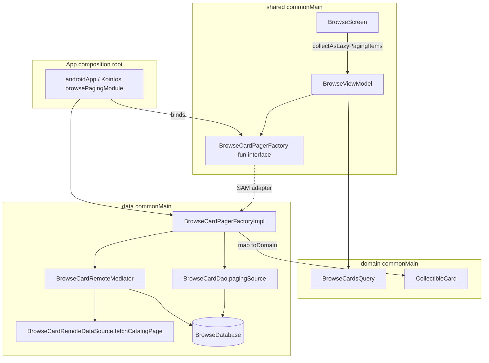
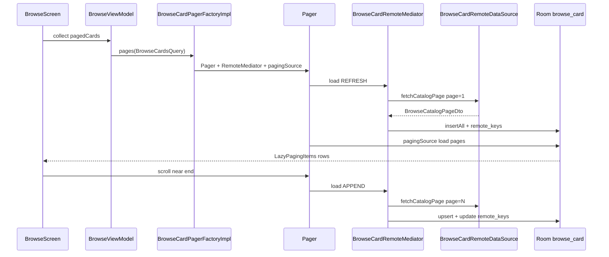
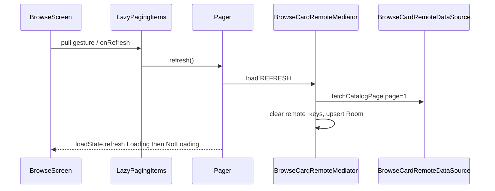

# Browse paging — data flow

This document describes how the Browse catalog uses **Paging 3**, **Room**, and the **network** layer while keeping `:domain` free of `androidx.*` types.

## Architecture overview

## Call sequence (first open + scroll)

## Pull-to-refresh (manual sync)

The list region uses Material3 `PullToRefreshBox` in [`BrowseScreen.kt`](../shared/src/commonMain/kotlin/com/devindie/cmptemplate/screens/browse/BrowseScreen.kt). Search and category chips stay fixed above the list. `isRefreshing` is true only when `loadState.refresh` is loading **and** `itemCount > 0`, so the first open still shows a centered spinner instead of the pull indicator. No ViewModel API — refresh stays at the `LazyPagingItems` boundary per Paging 3 conventions.

## Layer responsibilities

| Layer | Symbol | Role |
|-------|--------|------|
| **shared** | `BrowseCardPagerFactory` | Presentation port (`Flow<PagingData<CollectibleCard>>`); no `:data` imports in ViewModels |
| **shared** | `BrowseViewModel` | Debounced query + category → `flatMapLatest` pager; `cachedIn(viewModelScope)` |
| **shared** | `BrowseScreen` | `collectAsLazyPagingItems()`; refresh/append load states; pull-to-refresh calls `refresh()` → mediator REFRESH |
| **data** | `BrowseCardPagerFactoryImpl` | Builds `Pager` with config, mediator, filtered Room source |
| **data** | `BrowseCardRemoteMediator` | REFRESH/APPEND sync; offline seed when REFRESH fails on empty DB |
| **data** | `BrowseCardDao.pagingSource` | SQL filter for search/category (local-only filtering) |
| **data** | `BrowseRemoteKeyDao` | Tracks next network page (`browse_catalog` key) |
| **domain** | `BrowseCardsQuery`, `CollectibleCard` | Pure Kotlin filter model and row model |

## DI wiring (strict domain)

`BrowseCardPagerFactoryImpl` is registered in `platformDataModule()`. The **interface binding** lives at the composition root so `:data` never depends on `:shared`:

- Android: [`BrowsePagingModule.android.kt`](../shared/src/androidMain/kotlin/com/devindie/cmptemplate/BrowsePagingModule.android.kt) via `CmpTemplateApplication`
- iOS: [`BrowsePagingModule.ios.kt`](../shared/src/iosMain/kotlin/com/devindie/cmptemplate/BrowsePagingModule.ios.kt) via `doInitKoin()`

## Paging configuration

Defined in [`BrowseCatalogPaging.kt`](../data/src/commonMain/kotlin/com/devindie/cmptemplate/data/source/local/browse/BrowseCatalogPaging.kt):

- `pageSize = 20`
- `prefetchDistance = 5`
- `initialLoadSize = 40`
- `maxSize = 200`

## Network contract

`GET /v1/browse/cards?page={n}&page_size={size}` → [`BrowseCatalogPageDto`](../data/src/commonMain/kotlin/com/devindie/cmptemplate/data/network/dto/BrowseCardDto.kt)

Fake remote ([`FakeBrowseCardRemoteDataSource`](../data/src/commonMain/kotlin/com/devindie/cmptemplate/data/source/remote/browse/FakeBrowseCardRemoteDataSource.kt)) slices [`BrowseCatalogSeeder`](../data/src/commonMain/kotlin/com/devindie/cmptemplate/data/source/local/browse/BrowseCatalogSeeder.kt) for offline demos.

## Related tests

| Test | Location |
|------|----------|
| Paginated fake remote | `data/.../FakeBrowseCardRemoteDataSourceTest.kt` |
| Ktor page query params | `data/.../KtorBrowseCardRemoteDataSourceTest.kt` |
| RemoteMediator + Room | `data/src/iosSimulatorArm64Test/.../BrowseCardRemoteMediatorTest.kt` |
| ViewModel debounce / factory | `shared/.../BrowseViewModelTest.kt` |
| Factory placement (Konsist) | `architecture/.../BrowsePagingArchitectureTest.kt` |
