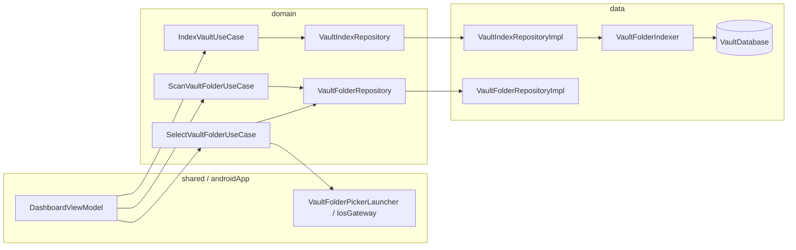

# Code documentation conventions

Inline documentation for cmp templateuses **Kotlin KDoc** (`/** ... */`). Layer placement and module boundaries are described in [kmp-feature-playbook.md](kmp-feature-playbook.md); this doc covers **what to write in source** and how symbols connect across layers.

---

## Format and style

- **KDoc only** for API documentation (no `//` block comments for public contracts).
- Present tense, complete sentences; avoid “This class is…”.
- Class-level KDoc: **≤ ~15 lines**; put algorithm detail on the owning method.
- Use `@param` / `@return` only when behavior is not clear from types.
- English only.

---

## What to document (by symbol kind)

| Symbol | Required | Content focus |
|--------|----------|----------------|
| Repository **interface** | Class + each public method | Contract, `Flow`/`Result` semantics, errors |
| Repository **impl** | Class | DataSources/DAOs coordinated; mapping notes |
| **DataSource** + platform impl | Class + non-obvious methods | Platform API (`DocumentFile`, security-scoped bookmark, etc.) |
| **Use case** | Class | User-visible operation; repository/gateway; side effects |
| **Domain model** / sealed types | Type + non-obvious fields | IDs (`storageKey`, `fileId`), state variants |
| **Gateway** | Class | Caller use case; null/cancel behavior |
| **ViewModel** | Class | Use cases injected; `UiState` transitions; jobs |
| **Screen** `@Composable` | Top-level only if non-trivial | Navigation args, state hoisting |
| **DI** modules / `startKoin` | Module or function | Bindings; `data.di` only at app entry |
| **Room** entity / DAO | File-level or class | Table role, relationships |
| **Internal** helpers | If non-obvious | e.g. path resolution, link extraction, hashing |
| **Trivial** `data class` | Type-level sentence | Skip per-property KDoc |

### Connection pattern (public boundaries)

Every repository, use case, gateway, impl, DataSource, and ViewModel should mention:

- **Upstream:** who calls this (type name).
- **Downstream:** what this delegates to.
- **`@see`** paired types across layers (interface ↔ impl, use case ↔ repository).

Example:

```kotlin
/**
 * Triggers a full or incremental index for the currently selected vault folder.
 *
 * **Flow:** [DashboardViewModel] → this → [VaultIndexRepository.indexSelectedVault].
 * **Side effects:** Persists files and wiki-links in Room; progress via [ObserveVaultIndexProgressUseCase].
 *
 * @see VaultIndexRepository
 * @see VaultFolderIndexer
 */
```

### Out of scope for full KDoc

- `architecture/` and `*Test.kt`: **one file-level** `/**` per file (what the test guards).
- Obvious private helpers and Compose layout internals.
- Duplicating the full playbook in every file.

No Detekt `MissingKDoc` enforcement — follow this doc by convention.

---

## Vault feature connection map

End-to-end flow for the primary vault folder + index feature. Use consistent step names in KDoc `@see` references.



| Step | Symbol | Module |
|------|--------|--------|
| Pick folder | `SelectVaultFolderUseCase` → `VaultFolderPickerGateway` | domain → data (iOS) / androidApp |
| Persist selection | `VaultFolderRepository.saveSelection` | domain → `VaultFolderRepositoryImpl` |
| Observe selection | `ObserveVaultFolderUseCase` → `VaultFolderRepository.observeSelection` | domain → data |
| Scan file counts | `ScanVaultFolderUseCase` → `VaultFolderScannerDataSource` | domain → data |
| Index vault | `IndexVaultUseCase` → `VaultIndexRepository` → `VaultFolderIndexer` | domain → data |
| Search / backlinks | `SearchVaultUseCase`, `GetBacklinksUseCase` → `VaultIndexRepository` | domain → data |
| Dashboard UI | `DashboardViewModel` collects use-case flows | shared |

### Indexing behavior (data layer)

- **Incremental:** Re-index only files whose size/mtime changed ([VaultFileChangeDetector]); skip content read when metadata matches.
- **Full rebuild:** Clears vault rows in Room, then indexes all files from scratch.
- **Links:** Markdown `[[wiki-links]]` extracted per file; stored as directed edges for backlinks/outgoing navigation.
- **Progress:** `VaultFolderIndexer` updates a shared `MutableStateFlow` consumed by `ObserveVaultIndexProgressUseCase`.

---

## Phased documentation checklist

When adding KDoc to a package, prefer this order:

1. Repository interfaces and gateways
2. Use cases
3. Domain models
4. Repository impls and DataSources
5. Indexer, DAOs, entities
6. ViewModels and screens
7. DI entry points

Verify: `./gradlew :architecture:test`

---

## References

- [kmp-feature-playbook.md](kmp-feature-playbook.md) — layer rules and feature checklist
- [AGENTS.md](../AGENTS.md) — agent conventions
