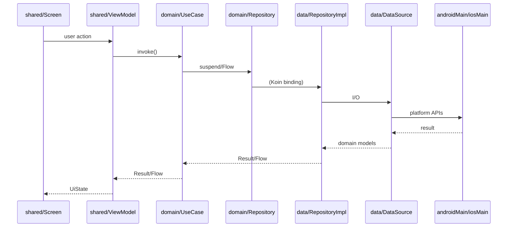

# KMP feature playbook — Clean Architecture + native APIs

Step-by-step guide for implementing features in cmp templatethat follow Clean Architecture and Kotlin Multiplatform conventions, including Android/iOS native APIs.

**When to use:** Any new feature, especially one that touches platform APIs (file access, permissions, Keychain, pickers, etc.).

**Verify:** `./gradlew :architecture:test` and `./gradlew qualityCheck`

### How to apply this playbook (Karpathy guidelines)

- **Think before coding:** State assumptions when starting a feature, especially around boundaries (what lives in `domain` vs `data` vs `shared`). If something is ambiguous, write it down in the PR description instead of guessing silently.
- **Simplicity first:** Implement the **minimum** layers and types needed for the feature. Do not add extra indirection, config, or generalisation "just in case" — one repository, one use case, one DataSource is often enough.
- **Surgical changes:** When touching existing code to wire a new feature, limit edits to what the playbook requires (new models, repository, use case, wiring). Avoid refactoring neighbouring code unless the feature truly depends on it.
- **Goal-driven execution:** For non-trivial changes, anchor work to verifiable checks (tests, architecture rules, perf numbers). Prefer "add test that fails, then implement until green" over implementing first and testing later.

---

## Module map (What / Where / Why)

| Layer | What | Where | Why |
|-------|------|-------|-----|
| Domain model | Plain Kotlin types the UI needs | `domain/src/commonMain/.../model/` | Stable, testable; no platform types |
| Repository contract | What the app needs, not how | `domain/.../repository/*Repository.kt` | Dependency inversion |
| Use case | One user-visible operation | `domain/.../usecase/<feature>/*UseCase.kt` | Thin ViewModels; reusable logic |
| DataSource contract | Platform I/O port | `data/.../commonMain/.../*DataSource.kt` | Hides Android/iOS from repository |
| Platform impl | Native API calls | `data/.../androidMain/`, `data/.../iosMain/` | Only place for `android.*` / `platform.*` |
| Repository impl | Orchestration + mapping | `data/.../commonMain/.../*RepositoryImpl.kt` | Single coordination point |
| ViewModel | UI state, calls use cases | `shared/.../screens/<feature>/` | Shared across platforms |
| Screen | Compose UI | `shared/.../screens/<feature>/` | UDF; state from ViewModel |
| Domain DI | Use cases | `shared/.../di/VaultDomainModule.kt` | No `data` imports |
| Platform DI | Bind platform classes | `data/.../di/PlatformDataModule.{kt,android.kt,ios.kt}` | Wired at app entry only |
| App entry | `startKoin` + `Context` | `androidApp/`, `shared/.../KoinIos.kt` | Only layer that imports `data.di` |

### Dependency direction (enforced by Konsist)

```
androidApp / iOS entry
    → data.di (platform bindings only)
shared (screens, ViewModels, domain DI)
    → domain
data
    → domain
domain
    → (no data, no presentation, no frameworks)
```

---

## Step 0 — Choose the abstraction

| Situation | Pattern | Why |
|-----------|---------|-----|
| Platform I/O behind a repository (scan folder, DB, crypto) | **Interface in `data/commonMain` + `Android*` / `Ios*` classes** | Easy to mock; Koin injects `Context` / platform services |
| Tiny platform utility (epoch millis, paths) | **`internal expect` / `actual` in `data`** | Small surface; not part of public API |
| Platform DI graph differs | **`expect fun platformDataModule()`** | App entry supplies bindings |
| Business rules on all platforms | **Pure Kotlin in `domain`** | Never `expect` in domain |

**Never** put `expect`/`actual` in `domain`. Domain must not import Android, Compose, Koin, Ktor, or `data`.

**Prefer interface + platform class** when implementations are large or need DI.

**Use `expect`/`actual`** only for small, `internal` helpers or library requirements (e.g. Room `RoomDatabaseConstructor`).

---

## Implementation steps

### Step 1 — Domain models

- **What:** `data class` / `sealed interface` — no `Uri`, `Context`, framework types.
- **Where:** `domain/src/commonMain/kotlin/.../model/`
- **Why:** Same types on Android and iOS; tests without platforms.

### Step 2 — Repository interface

- **What:** `interface XxxRepository` with `suspend` / `Flow` returning domain types or `Result`.
- **Where:** `domain/.../repository/` — must be an **interface** (Konsist).
- **Why:** Presentation reaches data only through use cases + this contract.

Example (existing):

```kotlin
// domain/.../repository/VaultFolderRepository.kt
interface VaultFolderRepository {
    fun observeSelection(): Flow<VaultFolderSelection?>
    suspend fun scanSelectedFolder(): Result<VaultFolderSummary>
}
```

### Step 3 — Use cases

- **What:** One class per operation; `suspend operator fun invoke`.
- **Where:** `domain/.../usecase/<feature>/`, name ends with `UseCase`.
- **Why:** ViewModels depend on use cases, not `*RepositoryImpl`.
- **How:** Use `UseCase<P, R>` or `UseCaseNoParams<R>` from `domain.usecase`.
- **Register:** `factoryOf(::YourUseCase)` in `shared/.../di/VaultDomainModule.kt`.

### Step 4 — DataSource interface (platform port)

- **What:** Small interface describing native capability; signatures use domain models or primitives.
- **Where:** `data/src/commonMain/.../`
- **Why:** `RepositoryImpl` stays in `commonMain`; platforms swap implementations.

Example (existing):

```kotlin
// data/.../VaultFolderScannerDataSource.kt
fun interface VaultFolderScannerDataSource {
    suspend fun scan(storageKey: String, folderDisplayName: String): Result<VaultFolderSummary>
}
```

### Step 5 — Android + iOS implementations

- **What:** Classes calling native APIs; map to domain types.
- **Where:**
  - `data/src/androidMain/.../AndroidXxxDataSource.kt`
  - `data/src/iosMain/.../IosXxxDataSource.kt`
- **Why:** Keeps platform imports out of `commonMain`.
- **How:** Use `withContext(Dispatchers.IO)` inside data sources; inject `Context` on Android via Koin.

Optional tiny helper:

```kotlin
// data/commonMain — internal only
internal expect fun currentEpochMillis(): Long
// androidMain / iosMain — actual implementations
```

### Step 6 — Repository implementation

- **What:** `XxxRepositoryImpl` implementing domain interface.
- **Where:** `data/src/commonMain/.../`
- **Why:** Coordinates data sources; maps to `Result` / `Flow`; no UI.
- **How:** Constructor takes **interfaces**, never `Android*` / `Ios*` types directly.

### Step 7 — Koin wiring (per platform)

- **What:** Bind `DataSource` → `Repository` interface.
- **Where:**
  - `expect fun platformDataModule()` in `data/.../di/PlatformDataModule.kt`
  - `actual` in `PlatformDataModule.android.kt` and `PlatformDataModule.ios.kt`
- **Why:** `:shared` must not import `data` (Konsist). Only app entry passes `platformDataModule()`.

Android app:

```kotlin
startKoinApp(appModules = listOf(platformDataModule(), androidPlatformModule))
```

iOS:

```kotlin
doInitKoin() // → startKoinApp(listOf(platformDataModule()))
```

Provide `Context` in `androidPlatformModule` in `androidApp`, not in `:shared`.

### Step 8 — ViewModel + screen

- **What:** `StateFlow` UI state; call use cases in `viewModelScope`.
- **Where:** `shared/.../screens/<feature>/`
- **Why:** Shared UI logic; no `data` or `*RepositoryImpl` imports.

**Platform-only UI** (folder picker, permission dialog):

- Keep picker in `androidApp` / iOS app shell (or platform callback at app layer).
- Pass **domain types** into use cases (e.g. `VaultFolderSelection`), not `Uri` into domain.

### Step 9 — Verify

```bash
./gradlew :architecture:test
# and
./gradlew qualityCheck
```

### Remote API + Room SSOT

When a feature needs network data but the UI should read from local storage:

1. **RemoteDataSource** (`data/remote/<feature>/`) — `suspend fun fetch…(): ApiResult<Dto>` (Ktor or `Fake*` for dev).
2. **LocalDataSource + Room** (`data/local/<feature>/`) — DAO, entities, `replaceAllCatalog`; UI observes DAO `Flow` (SSOT).
3. **RepositoryImpl** (`data/local/<feature>/`) — on sync: remote → map DTO → local upsert.
4. **Shared infra** (`data/auth`, `data/network`, `data/di`, `data/coroutines`) — [KSafe](https://github.com/ioannisa/KSafe) encrypted tokens (`KSafeTokenStore`), HttpClient, Koin.

Browse reference: `remote/browse/BrowseCardRemoteDataSource`, `local/browse/BrowseCardRepositoryImpl`, `networkModule()` in `data/di`.

---

## Decision tree: `expect`/`actual` vs interface

```
Need native API?
│
├─ Only inside data layer?
│   ├─ Large / needs DI (Context, NSFileManager)?
│   │   → interface XxxDataSource in data/commonMain
│   │   → AndroidXxx / IosXxx in platform source sets
│   │   → bind in platformDataModule()
│   │
│   └─ Tiny helper (time, single path)?
│       → internal expect fun in data/commonMain
│       → actual in androidMain + iosMain
│
├─ Business rule depends on platform?
│   → Push detail into DataSource; domain sees outcomes only
│
└─ UI-only (Activity result, UIViewController)?
    → androidApp / iOS app target
    → Map to domain type, then call use case
```

Vaulty examples:

- **Interface pattern:** `VaultFolderScannerDataSource` → `AndroidVaultFolderScannerDataSource` / `IosVaultFolderScannerDataSource`
- **expect/actual:** `PlatformTime`, `platformDataModule()`, Room `VaultDatabaseConstructor`

---

## Flow diagram



---

## Checklist

1. [ ] Domain models + `XxxRepository` interface in `domain`
2. [ ] `XxxUseCase`(s) in `domain/usecase/...`; register in `VaultDomainModule`
3. [ ] `XxxDataSource` interface in `data/commonMain`
4. [ ] `AndroidXxxDataSource` + `IosXxxDataSource` in platform source sets
5. [ ] `XxxRepositoryImpl` in `data/commonMain` (depends on interfaces only)
6. [ ] Bindings in `platformDataModule()` actuals
7. [ ] `platformDataModule()` from `androidApp` / `doInitKoin()`
8. [ ] `XxxViewModel` + screen in `shared`; use cases only
9. [ ] Platform UI at app shell → domain types into use case
10. [ ] `./gradlew :architecture:test` green

---

## File tree template

```
domain/src/commonMain/kotlin/.../
  model/FeatureItem.kt
  repository/FeatureRepository.kt
  usecase/feature/GetFeatureItemsUseCase.kt

data/src/commonMain/kotlin/.../
  feature/FeatureRepositoryImpl.kt
  feature/FeatureNativeDataSource.kt
  di/PlatformDataModule.kt                    # expect fun platformDataModule()

data/src/androidMain/kotlin/.../
  feature/AndroidFeatureNativeDataSource.kt
  di/PlatformDataModule.android.kt

data/src/iosMain/kotlin/.../
  feature/IosFeatureNativeDataSource.kt
  di/PlatformDataModule.ios.kt

shared/src/commonMain/kotlin/.../
  screens/feature/FeatureViewModel.kt
  screens/feature/FeatureScreen.kt
  di/VaultDomainModule.kt

androidApp/.../VaultyApp.kt
shared/iosMain/.../KoinIos.kt
```

---

## Common mistakes

| Mistake | Why it breaks |
|---------|----------------|
| `expect` in `domain` | Domain must compile without platforms |
| ViewModel imports `*RepositoryImpl` or `data` | Konsist layer tests |
| `Uri` / `Context` in domain models | Leaks Android into iOS domain |
| `platformDataModule()` registered in `:shared` commonMain | `shared` cannot import `data` |
| Business logic in `AndroidXxxDataSource` | Belongs in use case or `RepositoryImpl` |
| `expect class` for every service | Harder DI/testing; prefer interface + impl |

---

## References

- [AGENTS.md](../AGENTS.md) — project conventions and Konsist summary
- Existing feature: vault folder — `VaultFolderRepository`, `VaultFolderScannerDataSource`, `platformDataModule()`
