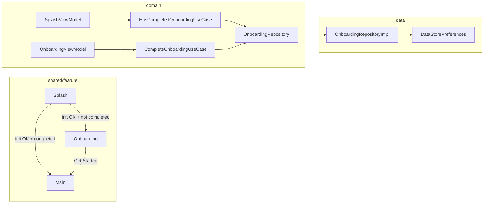

# Onboarding Feature — Design Spec

**Date:** 2026-06-24  
**Status:** Approved (brainstorming)  
**Scope:** First-run-only 3-slide onboarding carousel with KMP DataStore persistence

---

## Summary

Add a `feature/onboarding` package in `:shared` following the existing api/impl feature pattern. After splash init succeeds, first-time users see a 3-slide swipeable carousel with placeholder copy; returning users skip straight to main. Completion is persisted via **Jetpack DataStore Preferences (KMP)** in `:data`. No skip control — users must reach the last slide and tap **Get Started**.

---

## Requirements (decisions)

| Requirement | Decision |
|-------------|----------|
| When shown | First-run only — once per install |
| UI | 3-slide swipeable carousel with dot indicator |
| Skip | No — must complete carousel |
| CTA | **Next** on slides 1–2; **Get Started** on slide 3 |
| Content (v1) | Placeholder template (title + body + Material icon per slide) |
| Persistence | KMP DataStore Preferences (`booleanPreferencesKey`) |
| Module shape | Feature package in `:shared` — not a new Gradle module |

---

## Approach

**Chosen:** Feature package + Clean Architecture + KMP DataStore (Approach 1).

**Rejected:**
- KSafe boolean flag — encrypted storage for a non-sensitive preference
- In-memory only — violates first-run requirement
- Separate `OnboardingPreferencesDataSource` + SharedPreferences/NSUserDefaults — duplicates platform logic; DataStore KMP covers both platforms

---

## Architecture



### Domain

**`OnboardingRepository`** (`domain/.../repository/`)

```kotlin
interface OnboardingRepository {
    suspend fun hasCompleted(): Boolean
    suspend fun markCompleted()
}
```

**`HasCompletedOnboardingUseCase`** (`domain/.../usecase/onboarding/`)

```kotlin
class HasCompletedOnboardingUseCase(
    private val repository: OnboardingRepository,
) : UseCaseNoParams<Boolean> {
    override suspend fun invoke(): Boolean = repository.hasCompleted()
}
```

**`CompleteOnboardingUseCase`** (`domain/.../usecase/onboarding/`)

```kotlin
class CompleteOnboardingUseCase(
    private val repository: OnboardingRepository,
) : UseCaseNoParams<Unit> {
    override suspend fun invoke() {
        repository.markCompleted()
    }
}
```

Register both use cases in `AppDomainModule.kt` via `factoryOf`.

### Data — KMP DataStore

Per [Set up DataStore for KMP](https://developer.android.com/kotlin/multiplatform/datastore):

**Dependencies** — add to `data/build.gradle.kts` `commonMain`:

```kotlin
implementation(libs.androidx.datastore)
implementation(libs.androidx.datastore.preferences)
```

Version `1.2.1` is already declared in `gradle/libs.versions.toml`.

**Platform factory** (`data/.../onboarding/`)

| File | Role |
|------|------|
| `commonMain/.../OnboardingDataStore.kt` | `internal const val ONBOARDING_DATASTORE_FILE = "onboarding.preferences_pb"`; shared `createOnboardingDataStore(storage)` helper |
| `commonMain/.../createOnboardingDataStore.kt` | `expect fun createOnboardingDataStore(): DataStore<Preferences>` |
| `androidMain/.../createOnboardingDataStore.android.kt` | `FileStorage` + `PreferencesSerializer`; file in `context.filesDir` |
| `iosMain/.../createOnboardingDataStore.ios.kt` | `OkioStorage` + `PreferencesSerializer`; file in `NSDocumentDirectory` |

**`OnboardingRepositoryImpl`** (`data/.../commonMain/`)

```kotlin
private val ONBOARDING_COMPLETED_KEY = booleanPreferencesKey("onboarding_completed")

class OnboardingRepositoryImpl(
    private val dataStore: DataStore<Preferences>,
) : OnboardingRepository {
    override suspend fun hasCompleted(): Boolean =
        dataStore.data.first()[ONBOARDING_COMPLETED_KEY] ?: false

    override suspend fun markCompleted() {
        dataStore.edit { preferences ->
            preferences[ONBOARDING_COMPLETED_KEY] = true
        }
    }
}
```

**DI** — bind in `platformDataModule()` actuals (Android and iOS):

```kotlin
single { createOnboardingDataStore() }
single<OnboardingRepository> { OnboardingRepositoryImpl(dataStore = get()) }
```

### Presentation (`shared/.../feature/onboarding/`)

| Package | Contents |
|---------|----------|
| `api/` | `OnboardingScreen`, `OnboardingNavigation` (`OnboardingRoute`), `onboardingFeatureModule` |
| `impl/` | `OnboardingViewModel`, `OnboardingScreenUiState`, `OnboardingContent`, `OnboardingPages` (static slide list) |

Register `onboardingFeatureModule` in `AppDomainModule.kt`.

### App entry & navigation

`App.kt` root `NavHost`:

- `startDestination = SplashRoute` (unchanged)
- Add `OnboardingRoute` (`@Serializable data object` in `feature/onboarding/api/OnboardingNavigation.kt`)
- Flow: `SplashRoute` → `OnboardingRoute` → `MainShellRoute` (first run)
- Flow: `SplashRoute` → `MainShellRoute` (returning user)

Navigation pops:

- Splash → next: `popUpTo<SplashRoute> { inclusive = true }`
- Onboarding → main: `popUpTo<OnboardingRoute> { inclusive = true }`

---

## SplashViewModel changes

After startup succeeds (init OK + minimum display elapsed), check onboarding status:

1. Call `HasCompletedOnboardingUseCase()`
2. If `true` → emit navigation to main
3. If `false` → emit navigation to onboarding

**Navigation pattern:** Replace `isStartupComplete: Boolean` with `postStartupDestination: SplashPostStartupDestination?` in `SplashScreenUiState`:

```kotlin
sealed interface SplashPostStartupDestination {
    data object Main : SplashPostStartupDestination
    data object Onboarding : SplashPostStartupDestination
}
```

`SplashScreen` observes `postStartupDestination` via `LaunchedEffect` and invokes the matching callback (`onNavigateToMain` / `onNavigateToOnboarding`), then clears or ignores re-emission.

`SplashScreen` signature gains `onNavigateToOnboarding: () -> Unit` alongside existing `onNavigateToMain`.

---

## OnboardingViewModel behavior

### UI state

```kotlin
data class OnboardingScreenUiState(
    val pages: List<OnboardingPage> = OnboardingPages.default,
    val currentPageIndex: Int = 0,
    val isCompleting: Boolean = false,
)

data class OnboardingPage(
    val title: String,
    val body: String,
    val icon: ImageVector, // impl-only; mapped in composable
)
```

Navigation is **not** stored in state. `OnboardingScreen` calls `onNavigateToMain()` via `LaunchedEffect` when `isCompleting` flips to done after `CompleteOnboardingUseCase` succeeds.

### Interactions

| Action | Behavior |
|--------|----------|
| Swipe pager | Updates `currentPageIndex` (synced with `PagerState`) |
| **Next** (slides 0–1) | `animateScrollToPage(currentPageIndex + 1)` |
| **Get Started** (slide 2) | `CompleteOnboardingUseCase()` → navigate to main |

No skip control.

### Placeholder slides (v1)

| # | Title | Body | Icon |
|---|-------|------|------|
| 1 | Welcome | Discover and collect your favorite cards. | `Icons.Outlined.Explore` |
| 2 | Browse | Swipe through curated collections anytime. | `Icons.Outlined.Collections` |
| 3 | Get started | Your collection is ready — dive in. | `Icons.Outlined.RocketLaunch` |

---

## UI layout

- Full-screen `Column`, `MaterialTheme.colorScheme.background`
- `HorizontalPager` (Compose Foundation — already on `:shared` classpath)
- Row of dot indicators below pager (active dot uses `primary`, inactive `outline`)
- Bottom `FilledButton`: label **Next** or **Get Started** based on `currentPageIndex`
- Edge-to-edge: `appStatusBarsPadding()` + `appNavigationBarsPadding()` (match splash)
- Stateless previewable composable in `api/`; state-holder entry wires ViewModel + navigation callback

---

## Files to create / modify

### New files

```
domain/src/commonMain/.../repository/OnboardingRepository.kt
domain/src/commonMain/.../usecase/onboarding/HasCompletedOnboardingUseCase.kt
domain/src/commonMain/.../usecase/onboarding/CompleteOnboardingUseCase.kt
domain/src/commonTest/.../fake/FakeOnboardingRepository.kt
domain/src/commonTest/.../usecase/onboarding/HasCompletedOnboardingUseCaseTest.kt
domain/src/commonTest/.../usecase/onboarding/CompleteOnboardingUseCaseTest.kt

data/src/commonMain/.../onboarding/OnboardingRepositoryImpl.kt
data/src/commonMain/.../onboarding/OnboardingDataStore.kt
data/src/commonMain/.../onboarding/createOnboardingDataStore.kt
data/src/androidMain/.../onboarding/createOnboardingDataStore.android.kt
data/src/iosMain/.../onboarding/createOnboardingDataStore.ios.kt
data/src/commonTest/.../onboarding/OnboardingRepositoryImplTest.kt

shared/src/commonMain/.../feature/onboarding/api/OnboardingScreen.kt
shared/src/commonMain/.../feature/onboarding/api/OnboardingNavigation.kt
shared/src/commonMain/.../feature/onboarding/api/OnboardingFeatureModule.kt
shared/src/commonMain/.../feature/onboarding/impl/OnboardingViewModel.kt
shared/src/commonMain/.../feature/onboarding/impl/OnboardingScreenUiState.kt
shared/src/commonMain/.../feature/onboarding/impl/OnboardingContent.kt
shared/src/commonMain/.../feature/onboarding/impl/OnboardingPages.kt
shared/src/commonTest/.../feature/onboarding/impl/OnboardingViewModelTest.kt
```

### Modified files

```
data/build.gradle.kts                          (DataStore dependencies)
data/src/androidMain/.../di/PlatformDataModule.android.kt
data/src/iosMain/.../di/PlatformDataModule.ios.kt

shared/src/commonMain/.../App.kt
shared/src/commonMain/.../core/di/AppDomainModule.kt
shared/src/commonMain/.../feature/splash/api/SplashScreen.kt
shared/src/commonMain/.../feature/splash/impl/SplashViewModel.kt
shared/src/commonMain/.../feature/splash/impl/SplashScreenUiState.kt
shared/src/commonTest/.../feature/splash/impl/SplashViewModelTest.kt
```

---

## Testing & verification

### Unit tests

| Layer | Test file | Cases |
|-------|-----------|-------|
| domain | `HasCompletedOnboardingUseCaseTest` | Returns repository value; default false |
| domain | `CompleteOnboardingUseCaseTest` | Delegates `markCompleted()` |
| data | `OnboardingRepositoryImplTest` | Default false; `markCompleted` → true; persists across reads |
| shared | `OnboardingViewModelTest` | Next advances page; Get Started calls use case + triggers navigation |
| shared | `SplashViewModelTest` | Routes to onboarding when not completed; routes to main when completed |

Use `FakeOnboardingRepository` in domain/shared tests. DataStore tests use in-memory or temp-file `DataStore` per Android DataStore testing guidance.

### Commands

```bash
./gradlew :architecture:test
./gradlew qualityCheck
```

### Out of scope (v1)

- Skip button or “remind me later”
- Compose UI / screenshot tests
- Settings entry to replay onboarding
- Remote config / A/B slide content
- Separate Gradle module for onboarding

### Manual test plan

| Platform | Check |
|----------|-------|
| Android | Fresh install: splash → onboarding → main |
| Android | Second launch: splash → main (skip onboarding) |
| Android | Swipe + Next both advance slides |
| Android | Get Started only on last slide |
| iOS | Same flows as Android |
| Both | Kill app mid-onboarding → onboarding shows again on relaunch |

---

## Non-goals

- Auth or permission steps in onboarding
- Custom Lottie / animation beyond pager swipe
- Localized strings (hardcoded English placeholders for v1)
- Replay onboarding from settings

---

## Future extensions

- Add `onboarding_version` int key in DataStore to re-show onboarding after major updates
- Move slide copy to `composeResources` for localization
- Feature flag (`new_onboarding_v2`) via remote config
- Optional skip after analytics review
