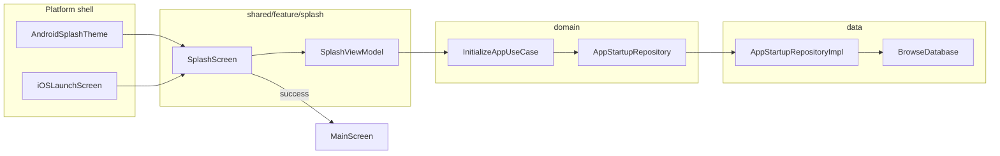
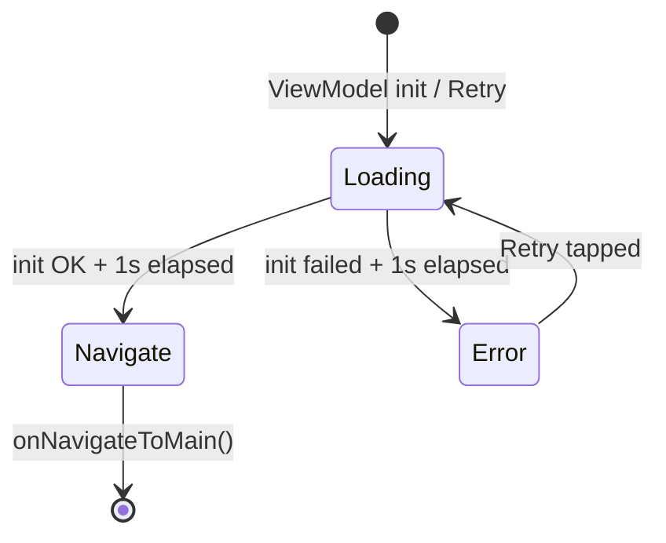

# Splash Screen Feature — Design Spec

**Date:** 2026-06-24  
**Status:** Approved (brainstorming)  
**Scope:** Branded splash with app initialization gate, native + Compose on Android and iOS

---

## Summary

Add a `feature/splash` package in `:shared` following the existing api/impl feature pattern. The splash shows branded UI for at least 1 second while `InitializeAppUseCase` verifies app readiness (v1: database probe). On success, navigate to `MainScreen`; on failure, show an error with Retry. Android uses the SplashScreen API for seamless handoff; iOS gets a matching Launch Screen.

---

## Requirements (decisions)

| Requirement | Decision |
|-------------|----------|
| Primary purpose | Branding + initialization gate |
| Init work (v1) | `InitializeAppUseCase` → `AppStartupRepository.ensureReady()` (DB open/probe) |
| Extensibility | Repository orchestrates future steps (auth, remote config) without ViewModel changes |
| Platform launch | Native splash (Android SplashScreen API + iOS LaunchScreen) + Compose branded UI |
| Minimum display | 1 second (parallel with init) |
| Init failure | Error message + Retry button on splash |
| Module shape | Feature package in `:shared` — not a new Gradle module |

---

## Approach

**Chosen:** Feature package + full Clean Architecture layers (Approach 1).

**Rejected:**
- ViewModel calling data directly — violates Konsist boundaries
- New Gradle module `:splash` — inconsistent with project conventions, extra wiring for little gain

---

## Architecture



### Domain

**`AppStartupRepository`** (`domain/.../repository/`)

```kotlin
interface AppStartupRepository {
    suspend fun ensureReady(): Result<Unit>
}
```

**`InitializeAppUseCase`** (`domain/.../usecase/startup/`)

```kotlin
class InitializeAppUseCase(
    private val repository: AppStartupRepository,
) : UseCaseNoParams<Result<Unit>> {
    override suspend fun invoke(): Result<Unit> = repository.ensureReady()
}
```

Register in `AppDomainModule.kt` via `factoryOf(::InitializeAppUseCase)`.

### Data

**`AppStartupRepositoryImpl`** (`data/.../commonMain/`)

- Depends on `BrowseDatabase` (injected via Koin, already wired in `platformDataModule`)
- `ensureReady()`: lightweight probe — e.g. `browseCardDao().count()` inside try/catch
- Returns `Result.success(Unit)` on success, `Result.failure(exception)` on failure
- Bind `AppStartupRepository` → `AppStartupRepositoryImpl` in `platformDataModule()` (both Android and iOS actuals)

### Presentation (`shared/.../feature/splash/`)

| Package | Contents |
|---------|----------|
| `api/` | `SplashScreen`, `SplashNavigation`, `SplashRoute`, `splashFeatureModule` |
| `impl/` | `SplashViewModel`, `SplashScreenUiState`, `SplashContent` (branded layout) |

Register `splashFeatureModule` in `AppDomainModule.kt`.

### App entry

`App.kt` hosts a root `NavHost`:

- `startDestination = SplashRoute` (`@Serializable data object` in `feature/splash/api/SplashNavigation.kt`)
- `MainShellRoute` (`@Serializable data object` in `core/navigation/MainShellRoute.kt`) wraps `MainScreen()` — distinct from tab-level `MainRoute` (Browse/Cart/Collection/Profile)
- On success: `navigate(MainShellRoute) { popUpTo<SplashRoute> { inclusive = true } }`
- `MainScreen` and its inner tab `NavHost` remain unchanged

---

## SplashViewModel behavior

### UI state

```kotlin
data class SplashScreenUiState(
    val phase: SplashPhase = SplashPhase.Loading,
    val errorMessage: String? = null,
)

enum class SplashPhase {
    Loading,
    Error,
}
```

Navigation is **not** stored in state. `SplashScreen` calls `onNavigateToMain()` via `LaunchedEffect` when startup completes successfully.

### Startup flow



On `init` and on **Retry**:

1. Set `phase = Loading`, clear `errorMessage`
2. Run in parallel inside `viewModelScope`:
   - `initializeAppUseCase()`
   - `delay(1_000)` (minimum display)
3. Await both
4. **Success** → trigger `onNavigateToMain()` from composable
5. **Failure** → `phase = Error`, set `errorMessage` from `Result` or generic fallback

The 1s minimum always applies. On failure, error UI appears only after the minimum time elapses.

---

## UI & platform native splash

### Compose layout

- Full-screen `Box`, `MaterialTheme.colorScheme.background`
- Centered app icon (Android `ic_launcher` via `painterResource`; iOS shared asset or placeholder for v1)
- App name "CMPTemplate" — `headlineSmall`, `onBackground`
- `CircularProgressIndicator` while `phase == Loading`
- Error text + Material3 Retry `Button` when `phase == Error`
- Edge-to-edge: `appStatusBarsPadding()` + `appNavigationBarsPadding()`

Stateless previewable composable in `api/`; state-holder entry wires ViewModel + navigation callback.

### Android

- Dependency: `androidx.core:core-splashscreen` in `androidApp`
- `Theme.CmpTemplate.Splash` — `Theme.SplashScreen`, background `#F9F9FF`, `postSplashScreenTheme = Theme.CmpTemplate`
- `Theme.CmpTemplate` — post-splash app theme
- `values-night/themes.xml` — dark background `#273143`
- Manifest: splash theme on `MainActivity`
- `MainActivity`: `installSplashScreen()` before `super.onCreate()`

### iOS

- `LaunchScreen.storyboard` with background `#F9F9FF` and centered app icon
- Register via `UILaunchStoryboardName` in `Info.plist`
- Add to `iosApp.xcodeproj`

### Color alignment

| Surface | Light | Dark |
|---------|-------|------|
| Native launch bg | `#F9F9FF` | `#273143` |
| Compose splash bg | `colorScheme.background` | same |
| Progress accent | `colorScheme.secondary` | same |

---

## Files to create / modify

### New files

```
domain/src/commonMain/.../repository/AppStartupRepository.kt
domain/src/commonMain/.../usecase/startup/InitializeAppUseCase.kt
domain/src/commonTest/.../fake/FakeAppStartupRepository.kt
domain/src/commonTest/.../usecase/startup/InitializeAppUseCaseTest.kt

data/src/commonMain/.../AppStartupRepositoryImpl.kt
data/src/commonTest/.../AppStartupRepositoryImplTest.kt

shared/src/commonMain/.../feature/splash/api/SplashScreen.kt
shared/src/commonMain/.../feature/splash/api/SplashNavigation.kt
shared/src/commonMain/.../feature/splash/api/SplashFeatureModule.kt
shared/src/commonMain/.../feature/splash/impl/SplashViewModel.kt
shared/src/commonMain/.../feature/splash/impl/SplashScreenUiState.kt
shared/src/commonMain/.../feature/splash/impl/SplashContent.kt
shared/src/commonTest/.../feature/splash/impl/SplashViewModelTest.kt

androidApp/src/main/res/values/themes.xml
androidApp/src/main/res/values-night/themes.xml

iosApp/iosApp/LaunchScreen.storyboard
```

### Modified files

```
shared/src/commonMain/.../App.kt
shared/src/commonMain/.../core/di/AppDomainModule.kt
shared/src/commonMain/.../core/navigation/MainShellRoute.kt

androidApp/src/main/AndroidManifest.xml
androidApp/src/main/kotlin/.../MainActivity.kt
androidApp/build.gradle.kts (core-splashscreen dependency)

data/src/androidMain/.../di/PlatformDataModule.android.kt
data/src/iosMain/.../di/PlatformDataModule.ios.kt

iosApp/iosApp/Info.plist
iosApp/iosApp.xcodeproj/project.pbxproj
```

---

## Testing & verification

### Unit tests

| Layer | Test file | Cases |
|-------|-----------|-------|
| domain | `InitializeAppUseCaseTest` | Success/failure propagation via `FakeAppStartupRepository` |
| data | `AppStartupRepositoryImplTest` | DB probe success; exception → `Result.failure` |
| shared | `SplashViewModelTest` | Success after 1s; slow init waits longer; failure → error; retry recovers |

Use `runViewModelTest`, `advanceTimeBy(1_000)` on test scheduler for minimum delay.

### Commands

```bash
./gradlew :architecture:test
./gradlew qualityCheck
```

### Out of scope (v1)

- Compose UI / screenshot tests
- Instrumented SplashScreen API tests
- iOS launch screen UI tests
- Benchmark journey updates

### Manual test plan

| Platform | Check |
|----------|-------|
| Android | Cold start: system splash → Compose splash (no flash) → main after ~1s |
| Android | DB failure → error + Retry |
| Android | Dark mode splash background |
| iOS | Launch screen → Compose splash → main |
| Both | Retry recovers when DB healthy |

---

## Non-goals

- Full catalog warmup before main screen
- Custom splash animation beyond progress indicator
- Auth / remote config in v1 (structure supports adding later)
- Separate Gradle module for splash

---

## Future extensions

Add steps to `AppStartupRepositoryImpl.ensureReady()` without changing splash UI:

1. Restore user session (`GetUserSessionUseCase` logic inlined or composed)
2. Fetch remote config
3. Pre-warm network client

Each step returns early on failure; ViewModel behavior unchanged.
