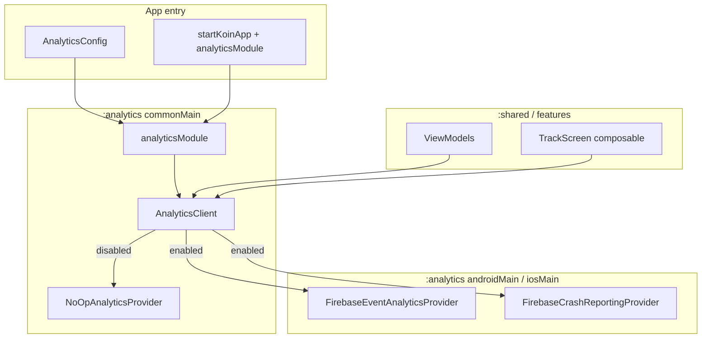

# Analytics Module — Design Spec

**Date:** 2026-06-25  
**Status:** Implemented  
**Scope:** Standalone `:analytics` KMP Gradle module for event tracking, screen views, user properties, and crash reporting; Firebase as default provider; swappable via init config; inject-and-use from ViewModels/composables

---

## Summary

Add a new Gradle module `:analytics` that exposes a single `AnalyticsClient` facade, configured once at Koin init via `analyticsModule(AnalyticsConfig(...))`. Firebase Analytics + Crashlytics are the default platform implementations; hosts swap providers by passing custom `EventAnalyticsProvider` / `CrashReportingProvider` in config. When `enabled = false`, all calls no-op (debug/tests). Features inject `AnalyticsClient` directly — no domain layer.

---

## Requirements (decisions)

| Requirement | Decision |
|-------------|----------|
| Module shape | New Gradle module `:analytics` (not packages in `:domain`/`:data`) |
| v1 capabilities | Custom events, screen views, user properties, crash reporting + breadcrumbs |
| Default backend | Firebase Analytics + Firebase Crashlytics |
| Swapping | Custom providers via `AnalyticsConfig`; no module code changes |
| Consumption | Direct `AnalyticsClient` injection in ViewModels / composables |
| Configuration | Init-time only — `AnalyticsConfig(enabled = …)`; no runtime consent API in v1 |
| Domain/data | None — `:analytics` is infrastructure; `:domain` and `:data` do not depend on it |

---

## Approach

**Chosen:** Facade + provider interfaces + config-driven provider selection (Approaches 1 + 3).

**Rejected:**
- Playbook `domain` repository + `data` Firebase impl — user chose standalone module
- `expect`/`actual` per function with no interfaces — harder to mock and swap
- Runtime consent toggle — user chose init-only config for v1
- Domain use cases wrapping analytics — unnecessary indirection for cross-cutting infra

---

## Architecture



### Dependency graph

```
:androidApp  → :analytics, :shared, :data
:shared      → :analytics, :domain
:analytics   → (no :domain, no :data)
:domain      → (unchanged — no analytics)
:data        → (unchanged — no Firebase)
```

Konsist: add `:analytics` as an allowed dependency for `:shared` presentation code. ViewModels may import `com.devindie.cmptemplate.analytics..` — same category as logging, not `data`.

---

## Public API

### AnalyticsClient

```kotlin
interface AnalyticsClient {
    fun logEvent(name: String, params: Map<String, Any> = emptyMap())
    fun logScreen(screenName: String, screenClass: String? = null)
    fun setUserProperty(name: String, value: String)
    fun setUserId(userId: String?)
    fun recordException(throwable: Throwable, message: String? = null)
    fun log(message: String) // Crashlytics breadcrumb
}
```

Extension for typed events (optional convenience):

```kotlin
data class AnalyticsEvent(val name: String, val params: Map<String, Any> = emptyMap())

fun AnalyticsClient.logEvent(event: AnalyticsEvent) = logEvent(event.name, event.params)
```

### Provider contracts (swappable)

```kotlin
interface EventAnalyticsProvider {
    fun logEvent(name: String, params: Map<String, Any>)
    fun logScreen(screenName: String, screenClass: String?)
    fun setUserProperty(name: String, value: String)
    fun setUserId(userId: String?)
}

interface CrashReportingProvider {
    fun recordException(throwable: Throwable, message: String?)
    fun log(message: String)
    fun setUserId(userId: String?)
}
```

### Config

```kotlin
data class AnalyticsConfig(
    val enabled: Boolean = true,
    val eventProvider: EventAnalyticsProvider? = null,
    val crashProvider: CrashReportingProvider? = null,
)
```

- `eventProvider == null` → platform Firebase Analytics (when `enabled`)
- `crashProvider == null` → platform Firebase Crashlytics (when `enabled`)
- `enabled == false` → `NoOpEventAnalyticsProvider` + `NoOpCrashReportingProvider` regardless of custom providers

### Koin module

```kotlin
fun analyticsModule(config: AnalyticsConfig): Module
```

Registers `single<AnalyticsClient> { AnalyticsClientImpl(...) }`.

### Compose helper (optional, in `:analytics`)

```kotlin
@Composable
fun TrackScreen(
    screenName: String,
    screenClass: String? = null,
    client: AnalyticsClient = koinInject(),
)
```

Logs screen view once per composition entry (not on every recomposition). Uses `DisposableEffect` / `LaunchedEffect(Unit)` pattern.

---

## Internal implementation

### AnalyticsClientImpl

Thin facade delegating to injected providers. Validates event names (snake_case, max 40 chars) and param keys in debug builds only via `assert` or internal check — production passes through to Firebase.

### NoOp providers

```kotlin
internal class NoOpEventAnalyticsProvider : EventAnalyticsProvider { /* no-ops */ }
internal class NoOpCrashReportingProvider : CrashReportingProvider { /* no-ops */ }
```

### Firebase — Android

- Dependencies via Firebase BOM: `firebase-analytics`, `firebase-crashlytics`
- `google-services` Gradle plugin on `:androidApp` only
- `FirebaseEventAnalyticsProvider(context: Context)` — maps params to `Bundle`
- `FirebaseCrashReportingProvider` — `FirebaseCrashlytics.getInstance()`
- Crashlytics auto-captures uncaught exceptions once SDK is initialized; `recordException` for handled errors

### Firebase — iOS

- GitLive Firebase Kotlin SDK (`firebase-app`, `firebase-analytics`, `firebase-crashlytics`) in `iosMain`
- CocoaPods in `:analytics` for compile-time linking (`FirebaseCore`, `FirebaseAnalytics`, `FirebaseCrashlytics`)
- Firebase iOS SDK via SPM in `iosApp` (Analytics + Crashlytics + Core)
- `FirebaseApp.configure()` in `iOSApp.swift` at launch
- Placeholder `GoogleService-Info.plist` in `iosApp/iosApp/`
- Crashlytics dSYM upload run script added by Xcode SPM setup
- iOS native unit tests disabled (Firebase linker complexity); `commonTest` runs on JVM

### Parameter mapping

| Kotlin type | Firebase |
|-------------|----------|
| `String` | string param |
| `Int` / `Long` | long param |
| `Double` | double param |
| `Boolean` | string `"true"` / `"false"` (Firebase limitation on some platforms) |

Unsupported types are dropped with a debug log, not thrown.

---

## App wiring

### Android (`CmpTemplateApplication`)

```kotlin
startKoinApp(
    appModules = listOf(
        platformDataModule(),
        browsePagingModule,
        analyticsModule(
            AnalyticsConfig(
                enabled = BuildConfig.DEBUG.not(), // example — host decides
            ),
        ),
    ),
) {
    androidContext(this@CmpTemplateApplication)
}
```

### iOS (`KoinIos.kt`)

```kotlin
startKoinApp(
    appModules = listOf(
        platformDataModule(),
        browsePagingModule,
        analyticsModule(AnalyticsConfig(enabled = true)),
    ),
)
```

### Swapping provider example

```kotlin
analyticsModule(
    AnalyticsConfig(
        enabled = true,
        eventProvider = AmplitudeEventProvider(apiKey),
        crashProvider = SentryCrashProvider(dsn),
    ),
)
```

---

## Usage examples

### ViewModel

```kotlin
class BrowseViewModel(
    private val analytics: AnalyticsClient,
    // … other deps
) : ViewModel() {
    fun onCardTapped(cardId: String) {
        analytics.logEvent("card_tapped", mapOf("card_id" to cardId))
    }
}
```

### Screen tracking

```kotlin
@Composable
fun BrowseScreen(/* … */) {
    TrackScreen(screenName = "browse")
    // …
}
```

### User session

```kotlin
analytics.setUserId(session.userId)
analytics.setUserProperty("subscription_tier", session.tier)
```

### Handled errors

```kotlin
analytics.log("Fetching cards failed")
analytics.recordException(e, message = "browse_load_failed")
```

---

## Gradle / project changes

### New module

```
analytics/
├── build.gradle.kts
└── src/
    ├── commonMain/kotlin/com/devindie/cmptemplate/analytics/
    │   ├── AnalyticsClient.kt
    │   ├── AnalyticsClientImpl.kt
    │   ├── AnalyticsConfig.kt
    │   ├── AnalyticsModule.kt
    │   ├── AnalyticsEvent.kt
    │   ├── compose/TrackScreen.kt
    │   └── provider/
    │       ├── EventAnalyticsProvider.kt
    │       ├── CrashReportingProvider.kt
    │       ├── NoOpEventAnalyticsProvider.kt
    │       └── NoOpCrashReportingProvider.kt
    ├── androidMain/kotlin/.../firebase/
    │   ├── FirebaseEventAnalyticsProvider.kt
    │   └── FirebaseCrashReportingProvider.kt
    ├── iosMain/kotlin/.../firebase/
    │   ├── FirebaseEventAnalyticsProvider.kt
    │   └── FirebaseCrashReportingProvider.kt
    └── commonTest/kotlin/.../
        ├── AnalyticsClientImplTest.kt
        └── NoOpProviderTest.kt
```

### Modified

| File | Change |
|------|--------|
| `settings.gradle.kts` | `include(":analytics")` |
| `gradle/libs.versions.toml` | Firebase BOM + plugin versions |
| `androidApp/build.gradle.kts` | `google-services` plugin, `implementation(projects.analytics)` |
| `shared/build.gradle.kts` | `implementation(projects.analytics)` |
| `androidApp/.../CmpTemplateApplication.kt` | `analyticsModule(...)` |
| `shared/.../KoinIos.kt` | `analyticsModule(...)` |
| `iosApp/iosApp.xcodeproj` | Firebase SPM packages (Analytics, Crashlytics) |

### Firebase project files (host responsibility)

- `androidApp/google-services.json` — placeholder + README note; not committed with real secrets
- `iosApp/GoogleService-Info.plist` — same

Document in README that Firebase console setup is required for real data; `enabled = false` or NoOp works without config files.

---

## Testing & verification

| Test | Cases |
|------|-------|
| `AnalyticsClientImplTest` | Delegates to fake providers; respects `enabled = false` |
| `NoOpProviderTest` | All methods are safe no-ops |
| Fake provider manual fakes | Used in ViewModel tests when needed |
| `:architecture:test` | Layer boundaries — `:domain` does not import `:analytics` |

```bash
./gradlew :analytics:allTests
./gradlew :architecture:test
./gradlew :androidApp:assembleDebug
```

### Manual (Android)

| Check | Expected |
|-------|----------|
| Debug build with `enabled = false` | Logcat shows no Firebase analytics events |
| Release with `google-services.json` | Firebase DebugView receives `screen_view` from `TrackScreen` |
| `recordException` on handled error | Appears in Crashlytics dashboard |
| Custom `NoOp` provider in test | ViewModel test asserts fake received event |

---

## Error handling

- Provider failures (Firebase not initialized, network) are caught internally and logged via `println` / Kermit in debug — **never** crash the app
- Invalid event names in debug: warn + still attempt send
- Missing `google-services.json`: Firebase init may fail — document that `enabled = false` is valid for local dev without Firebase project

---

## Out of scope (v1)

- Runtime consent / `setCollectionEnabled` API
- Built-in consent UI
- Firebase Performance Monitoring
- Sealed event catalog in the module (hosts define their own constants)
- Domain use cases for analytics
- Multi-provider fan-out (send to Firebase **and** Amplitude simultaneously)
- Architecture test changes beyond documenting `:shared` → `:analytics` as allowed
- Sample integration in a feature screen (wire module only; optional Browse `card_tapped` as demo in plan)

---

## Future extensions

- Runtime consent toggle aligned with legal/onboarding flows
- `MultiAnalyticsClient` fan-out to several providers
- Typed sealed `AppAnalyticsEvent` in `:shared` for compile-time event names
- Firebase Performance module or separate provider
- Gradle convention plugin `cmp.analytics` for one-line Firebase setup
