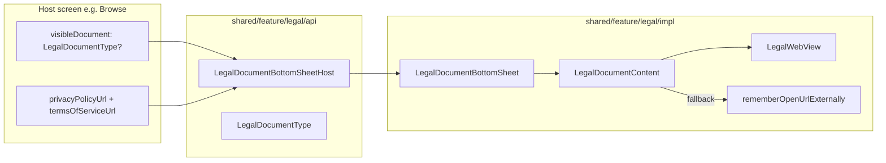

# Legal Documents Feature — Design Spec

**Date:** 2026-06-25  
**Status:** Implemented  
**Scope:** In-app Privacy Policy and Terms of Service in modal bottom sheets with external-browser fallback; host-supplied URLs; independent of `NavHost` routes

---

## Summary

Add a `feature/legal` package in `:shared` following the existing api/impl feature pattern. Hosts show documents via `LegalDocumentBottomSheetHost(visibleDocument, privacyPolicyUrl, termsOfServiceUrl, onDismiss)` with **required** URLs (no defaults inside the feature). Primary UX is an in-app WebView inside a `ModalBottomSheet`; external browser is the fallback (toolbar action + error state). v1 test entry: Browse tab buttons wired with local `LegalDocumentType?` state in `browseDestination()`.

---

## Requirements (decisions)

| Requirement | Decision |
|-------------|----------|
| Documents | Privacy Policy + Terms of Service (`LegalDocumentType` enum) |
| Presentation | `ModalBottomSheet` — not a `NavHost` destination |
| Primary UX | In-app WebView (scaffold + top bar inside sheet) |
| Fallback | Open in external/system browser (toolbar + error UI) |
| URL source | Required parameters on `LegalDocumentBottomSheetHost()` — wired by host at call site |
| Entry points (v1) | Browse test buttons only — no Profile/settings or onboarding links |
| Module shape | Feature package in `:shared` — not a new Gradle module |
| Domain/data | None for v1 — presentation only |

---

## Approach

**Chosen:** Bottom sheet host + local visibility state + expect/actual WebView and `rememberOpenUrlExternally` (Approach 1).

**Rejected:**
- `NavGraphBuilder.legalDestination()` — legal content is not part of the navigation graph
- URL embedded in navigation route args — N/A without routes
- External browser only — worse UX for legal reading flow
- Domain repository for static URLs — unnecessary for v1

---

## Architecture



No domain or data layers.

---

## API contract

```kotlin
enum class LegalDocumentType {
    PrivacyPolicy,
    TermsOfService,
}

@Composable
fun LegalDocumentBottomSheetHost(
    visibleDocument: LegalDocumentType?,
    privacyPolicyUrl: String,
    termsOfServiceUrl: String,
    onDismiss: () -> Unit,
)
```

**Host wiring pattern** (example from `browseDestination()`):

```kotlin
var visibleLegalDocument by remember { mutableStateOf<LegalDocumentType?>(null) }

BrowseScreen(
    onPrivacyPolicyClick = { visibleLegalDocument = LegalDocumentType.PrivacyPolicy },
    onTermsOfServiceClick = { visibleLegalDocument = LegalDocumentType.TermsOfService },
    ...
)

LegalDocumentBottomSheetHost(
    visibleDocument = visibleLegalDocument,
    privacyPolicyUrl = privacyPolicyUrl,
    termsOfServiceUrl = termsOfServiceUrl,
    onDismiss = { visibleLegalDocument = null },
)
```

`browseDestination()` exposes an overload with explicit URLs; the no-arg overload uses private test placeholder URLs for local dev only.

---

## UI

- `ModalBottomSheet` (fullscreen-style, `skipPartiallyExpanded = true`, no drag handle — matches card detail)
- Inner `Scaffold` + `TopAppBar`: dismiss, fixed title per document type
- Toolbar **Open in browser** icon — always visible (fallback shortcut)
- Body: platform `LegalWebView` loading the host URL
- Loading: centered `CircularProgressIndicator` until first page finish
- Error: message + **Retry** (reload WebView) + **Open in browser**

No `appStatusBarsPadding()` inside the sheet — the bottom sheet handles insets.

---

## Platform

| Platform | In-app | Fallback |
|----------|--------|----------|
| Android | `AndroidView` + `WebView` | `Intent(ACTION_VIEW, Uri.parse(url))` via `rememberOpenUrlExternally()` |
| iOS | `UIKitView` + `WKWebView` (`@ObjCSignatureOverride` on delegate) | `UIApplication.shared.openURL` |

`internal expect/actual` in `impl` — no third-party WebView library.

**Android:** `INTERNET` permission added to `androidApp` manifest for WebView loads.

---

## DI

```kotlin
val legalFeatureModule = module { }
```

Registered in `AppDomainModule` for consistency with other features.

---

## Files created / modified

### New

```
shared/.../feature/legal/api/LegalDocumentType.kt
shared/.../feature/legal/api/LegalDocumentBottomSheet.kt
shared/.../feature/legal/api/LegalFeatureModule.kt
shared/.../feature/legal/impl/LegalDocumentBottomSheet.kt
shared/.../feature/legal/impl/LegalDocumentScreenUiState.kt
shared/.../feature/legal/impl/LegalDocumentContent.kt
shared/.../feature/legal/impl/platform/LegalWebView.kt
shared/.../feature/legal/impl/platform/OpenUrlExternally.kt
shared/androidMain/.../feature/legal/impl/platform/LegalWebView.android.kt
shared/androidMain/.../feature/legal/impl/platform/OpenUrlExternally.android.kt
shared/iosMain/.../feature/legal/impl/platform/LegalWebView.ios.kt
shared/iosMain/.../feature/legal/impl/platform/OpenUrlExternally.ios.kt
shared/commonTest/.../feature/legal/api/LegalDocumentTypeTest.kt
```

### Modified

```
shared/.../core/di/AppDomainModule.kt
shared/.../feature/browse/api/BrowseNavigation.kt
shared/.../feature/browse/impl/BrowseScreen.kt
androidApp/src/main/AndroidManifest.xml
```

---

## Testing & verification

| Test | Cases |
|------|-------|
| `LegalDocumentTypeTest` | Enum values stable |
| `:architecture:test` | Layer boundaries |

```bash
./gradlew :architecture:test
./gradlew :shared:iosSimulatorArm64Test --tests "com.devindie.cmptemplate.feature.legal.*"
./gradlew :androidApp:assembleDebug
```

### Manual

| Check | Expected |
|-------|----------|
| Browse → Privacy Policy button | Bottom sheet opens; WebView loads host URL |
| Browse → Terms button | Same for terms URL |
| Toolbar open-in-browser | System browser opens same URL |
| Airplane mode / bad URL | Error UI; Retry reloads; Open in browser works |
| Dismiss (back / swipe) | Sheet closes; Browse tab unchanged |

---

## Out of scope (v1)

- `NavHost` routes for legal documents
- Profile/settings list entry
- Onboarding footer links
- Domain URL repository / remote config
- Localized strings (English titles hardcoded)
- Compose UI screenshot tests

---

## Future extensions

- Profile tab entry using the same `LegalDocumentBottomSheetHost` pattern
- `composeResources` for titles
- Android Custom Tabs for branded external fallback
- Remove Browse test buttons when a real entry point exists
