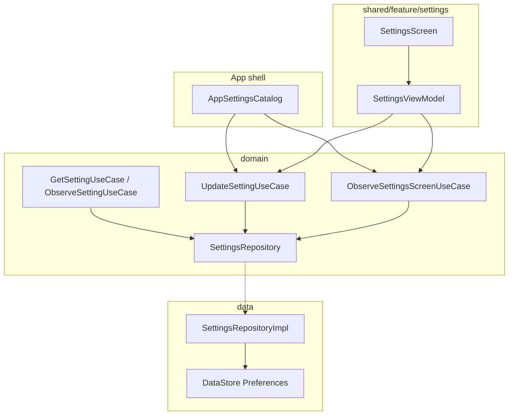

# Settings Module — Design Spec

**Date:** 2026-06-25  
**Status:** Approved (brainstorming — Approach 1)  
**Scope:** Definition-driven Settings screen with typed local persistence and externally configured catalog

---

## Summary

Add a `feature/settings` package in `:shared` plus domain/data layers for a **general-purpose local settings store**. The app shell supplies a `SettingsCatalog` (sections + `SettingDefinition` list); the settings module owns **read/write persistence** (KMP DataStore Preferences) and **renders the Settings UI** from those definitions. Other features consume settings through domain use cases and `SettingKey` constants they define — no custom callbacks in definitions.

---

## Requirements (decisions)

| Requirement | Decision |
|-------------|----------|
| Scope | Data layer + Settings screen (Approach B) |
| Configuration | **Definitions only** — title, type, default, key; no per-item callbacks |
| External config | App shell implements `SettingsCatalog`, aggregating definitions from features |
| Setting types (v1) | Boolean, single choice, multi choice, free text, number (int/long/double) |
| Persistence | Single KMP DataStore Preferences file (`user_settings.preferences_pb`) |
| Cross-feature reads | `GetSettingUseCase`, `ObserveSettingUseCase`, `UpdateSettingUseCase` |
| Screen data | `ObserveSettingsScreenUseCase` merges catalog + stored values |
| Navigation | Profile tab → push `SettingsRoute` |
| Module shape | Feature package in `:shared` — not a new Gradle module |
| Out of scope (v1) | Custom composables per feature, encrypted settings, remote sync, migrating `OnboardingRepository` |

---

## Approach

**Chosen:** Typed catalog + single `SettingsRepository` (Approach 1).

**Rejected:**
- Per-feature repositories — not reusable; settings screen must know every repo
- JSON blob per section — weak typing, poor per-key `Flow` observation

---

## Architecture



### Dependency direction

```
androidApp / iOS entry
    → SettingsCatalog binding + platformDataModule()
shared/feature/settings (api + impl)
    → domain (use cases, models, SettingsCatalog interface)
data/settings
    → domain (SettingsRepository impl)
domain
    → pure Kotlin only
```

Other features depend on `domain` use cases + their own `SettingKey` constants in `feature/<name>/api/` — never on `data` or settings UI.

---

## Domain

### Models (`domain/.../model/settings/`)

**`SettingKey`** — `@JvmInline value class` wrapping `String`. Each feature owns keys in its `api` package.

**`SettingValue`** — sealed class:

```kotlin
sealed interface SettingValue {
    data class BooleanValue(val value: Boolean) : SettingValue
    data class TextValue(val value: String) : SettingValue
    data class IntValue(val value: Int) : SettingValue
    data class LongValue(val value: Long) : SettingValue
    data class DoubleValue(val value: Double) : SettingValue
    data class SingleChoiceValue(val optionId: String) : SettingValue
    data class MultiChoiceValue(val optionIds: Set<String>) : SettingValue
}
```

**`SettingOption`** — `data class SettingOption(val id: String, val label: String)`

**`SettingDefinition`** — sealed class (mirrors value types):

| Type | Fields |
|------|--------|
| `BooleanSettingDefinition` | `key`, `title`, `description?`, `default: Boolean` |
| `TextSettingDefinition` | `key`, `title`, `description?`, `default: String`, `maxLength?` |
| `IntSettingDefinition` | `key`, `title`, `description?`, `default`, `min?`, `max?` |
| `LongSettingDefinition` | same as int |
| `DoubleSettingDefinition` | `key`, `title`, `description?`, `default`, `min?`, `max?` |
| `SingleChoiceSettingDefinition` | `key`, `title`, `description?`, `options`, `defaultOptionId` |
| `MultiChoiceSettingDefinition` | `key`, `title`, `description?`, `options`, `defaultOptionIds: Set<String>` |

**`SettingsSection`** — `data class SettingsSection(val id: String, val title: String, val definitions: List<SettingDefinition>)`

**`SettingsScreenModel`** — presentation-neutral screen state:

```kotlin
data class SettingsScreenModel(
    val sections: List<SettingsSectionModel>,
)

data class SettingsSectionModel(
    val id: String,
    val title: String,
    val items: List<SettingsItemModel>,
)

sealed interface SettingsItemModel {
    val key: SettingKey
    val title: String
    val description: String?
    // type-specific current value fields per variant
}
```

### Catalog (`domain/.../settings/SettingsCatalog.kt`)

```kotlin
interface SettingsCatalog {
    val sections: List<SettingsSection>
    fun definition(key: SettingKey): SettingDefinition?
    fun allDefinitions(): List<SettingDefinition> = sections.flatMap { it.definitions }
}
```

Implemented once in app shell (e.g. `AppSettingsCatalog`) composing feature-supplied definition lists.

**Example feature contribution** (`shared/.../feature/browse/api/BrowseSettings.kt`):

```kotlin
object BrowseSettings {
    val ShowPrices = SettingKey("browse.show_prices")

    fun definitions(): List<SettingDefinition> = listOf(
        BooleanSettingDefinition(
            key = ShowPrices,
            title = "Show prices",
            description = "Display card prices in browse lists",
            default = true,
        ),
    )
}
```

**Example app catalog** (`androidApp/.../AppSettingsCatalog.kt` or `shared/.../settings/AppSettingsCatalog.kt`):

```kotlin
class AppSettingsCatalog : SettingsCatalog {
    override val sections = listOf(
        SettingsSection(
            id = "browse",
            title = "Browse",
            definitions = BrowseSettings.definitions(),
        ),
        SettingsSection(
            id = "appearance",
            title = "Appearance",
            definitions = AppSettings.appearanceDefinitions(),
        ),
    )

    override fun definition(key: SettingKey): SettingDefinition? =
        allDefinitions().firstOrNull { it.key == key }
}
```

### Repository (`domain/.../repository/SettingsRepository.kt`)

```kotlin
interface SettingsRepository {
    fun observeValue(key: SettingKey): Flow<SettingValue?>
    suspend fun getValue(key: SettingKey): SettingValue?
    suspend fun setValue(key: SettingKey, value: SettingValue)
}
```

Repository stores raw values only. Defaults and validation live in use cases.

### Use cases (`domain/.../usecase/settings/`)

| Use case | Signature | Role |
|----------|-----------|------|
| `GetSettingUseCase` | `(SettingKey) → SettingValue?` | Resolves stored value or catalog default |
| `ObserveSettingUseCase` | `(SettingKey) → Flow<SettingValue?>` | Reactive read for other features |
| `UpdateSettingUseCase` | `(SettingKey, SettingValue) → Result<Unit>` | Validates against catalog, persists |
| `ObserveSettingsScreenUseCase` | `() → Flow<SettingsScreenModel>` | Merges catalog sections + resolved values |

**`UpdateSettingUseCase` validation rules:**

- Key must exist in catalog; else `Result.failure(UnknownSettingKey)`
- Value variant must match definition variant; else `Result.failure(TypeMismatch)`
- Text: enforce `maxLength` if set
- Numbers: enforce `min`/`max` if set
- Single choice: `optionId` must be in `options`
- Multi choice: every `optionId` must be in `options`

**Domain errors** (`domain/.../model/settings/SettingsError.kt`):

```kotlin
sealed interface SettingsError {
    data object UnknownSettingKey : SettingsError
    data object TypeMismatch : SettingsError
    data class OutOfRange(val message: String) : SettingsError
    data class InvalidChoice(val message: String) : SettingsError
    data class TextTooLong(val maxLength: Int) : SettingsError
}
```

### DI registration

Register use cases in `shared/.../core/di/AppDomainModule.kt` via `factoryOf`.

Register `SettingsCatalog` in **app entry** (`androidApp` / iOS Koin init) as `single<SettingsCatalog> { AppSettingsCatalog() }` — not in `:shared` commonMain (keeps catalog app-specific and avoids circular feature imports).

---

## Data

### Package (`data/.../settings/`)

| File | Responsibility |
|------|----------------|
| `SettingsRepositoryImpl.kt` | Maps `SettingKey` + `SettingValue` ↔ DataStore preference keys |
| `createSettingsDataStore.android.kt` | `PreferenceDataStoreFactory.create` with `Context` |
| `createSettingsDataStore.ios.kt` | `PreferenceDataStoreFactory.createWithPath` |
| `SettingsPreferenceKeys.kt` | Internal helpers: `prefKeyFor(key, type)` naming `setting_<key>` |

### DataStore key mapping

| `SettingValue` variant | Preferences key type |
|------------------------|----------------------|
| `BooleanValue` | `booleanPreferencesKey("setting_<key>")` |
| `TextValue`, `SingleChoiceValue` | `stringPreferencesKey` |
| `MultiChoiceValue` | `stringSetPreferencesKey` |
| `IntValue` | `intPreferencesKey` |
| `LongValue` | `longPreferencesKey` |
| `DoubleValue` | `doublePreferencesKey` |

Type is implied by the key suffix convention and the definition at read time. Repository does not validate — use cases do.

### Platform DI (`data/.../di/PlatformDataModule.*.kt`)

```kotlin
single { createSettingsDataStore(get<Context>()) }  // Android
single { createSettingsDataStore() }                 // iOS
single<SettingsRepository> { SettingsRepositoryImpl(dataStore = get()) }
```

Separate DataStore file from onboarding (`settings.preferences_pb` vs `onboarding.preferences_pb`).

### Tests (`data/.../settings/SettingsRepositoryImplTest.kt`)

In-memory DataStore via `PreferenceDataStoreFactory.createWithPath` (same pattern as `OnboardingRepositoryImplTest`).

---

## Presentation (`shared/feature/settings/`)

### `api/`

| File | Responsibility |
|------|----------------|
| `SettingsRoute.kt` | `@Serializable data object SettingsRoute` |
| `SettingsNavigation.kt` | `NavController.navigateToSettings()`, Profile integration |
| `SettingsScreen.kt` | Public composable entry |
| `settingsFeatureModule.kt` | `viewModelOf(::SettingsViewModel)` |

### `impl/`

| File | Responsibility |
|------|----------------|
| `SettingsViewModel.kt` | Collects `ObserveSettingsScreenUseCase`; calls `UpdateSettingUseCase` on edits |
| `SettingsScreenUiState.kt` | Maps `SettingsScreenModel` to UI state (or alias if 1:1) |
| `SettingsContent.kt` | Scaffold, top bar, lazy list of sections |
| `SettingsItemRow.kt` | Dispatches to type-specific row composable |
| `BooleanSettingRow.kt` | `Switch` |
| `SingleChoiceSettingRow.kt` | Exposed dropdown or selection dialog |
| `MultiChoiceSettingRow.kt` | Checkbox list in dialog |
| `TextSettingRow.kt` | `OutlinedTextField` with debounced/commit save |
| `NumberSettingRow.kt` | Numeric field with validation feedback |

### ViewModel contract

```kotlin
class SettingsViewModel(
    observeSettingsScreen: ObserveSettingsScreenUseCase,
    private val updateSetting: UpdateSettingUseCase,
) : ViewModel() {
    val uiState: StateFlow<SettingsScreenUiState>

    fun onSettingChanged(key: SettingKey, value: SettingValue)
}
```

Errors from `UpdateSettingUseCase` surface as one-shot snackbar / inline field error (v1: snackbar is sufficient).

### Navigation

- Add `SettingsRoute` to Profile tab `NavHost` (nested under `MainRoute.Profile`).
- Profile tab shows entry point (e.g. "Settings" list row or gear icon in top bar) → `navigateToSettings()`.
- Settings screen back navigates to Profile root.

---

## Cross-feature consumption pattern

When browse needs `ShowPrices`:

```kotlin
class BrowseViewModel(
    private val observeSetting: ObserveSettingUseCase,
) : ViewModel() {
    // ObserveSettingUseCase(BrowseSettings.ShowPrices)
    // defaults to true when unset (via use case + catalog)
}
```

No import of settings UI or `SettingsRepositoryImpl`.

---

## Error handling

| Case | Behavior |
|------|----------|
| Unknown key on update | `UpdateSettingUseCase` → `Result.failure(UnknownSettingKey)` |
| Type mismatch | `Result.failure(TypeMismatch)` |
| Out-of-range number | `Result.failure(OutOfRange(...))` |
| Invalid choice id | `Result.failure(InvalidChoice(...))` |
| Text too long | `Result.failure(TextTooLong(...))` |
| DataStore I/O failure | Wrap in `Result.failure`; ViewModel shows snackbar |
| Missing catalog entry on read | `GetSettingUseCase` returns `null` (no default) |

---

## Testing strategy

| Layer | Tests |
|-------|-------|
| Domain | `UpdateSettingUseCaseTest` (validation matrix per type), `GetSettingUseCaseTest` (default fallback), `ObserveSettingsScreenUseCaseTest` |
| Data | `SettingsRepositoryImplTest` round-trip per value type |
| Presentation | `SettingsViewModelTest` with fake use cases |
| Architecture | `./gradlew :architecture:test` |

Fakes: `FakeSettingsRepository`, `FakeSettingsCatalog` in `domain/src/commonTest/.../fake/`.

---

## v1 demo catalog

`AppSettingsCatalog` includes at minimum:

1. **Appearance** section — `BooleanSettingDefinition` (e.g. "Show card images")
2. **Browse** section — `BrowseSettings.definitions()` with `ShowPrices` toggle

Proves external configuration from a feature package and app-level section grouping.

---

## File checklist (implementation reference)

### Create — domain

- `domain/.../model/settings/SettingKey.kt`
- `domain/.../model/settings/SettingValue.kt`
- `domain/.../model/settings/SettingOption.kt`
- `domain/.../model/settings/SettingDefinition.kt`
- `domain/.../model/settings/SettingsSection.kt`
- `domain/.../model/settings/SettingsScreenModel.kt`
- `domain/.../model/settings/SettingsError.kt`
- `domain/.../settings/SettingsCatalog.kt`
- `domain/.../repository/SettingsRepository.kt`
- `domain/.../usecase/settings/GetSettingUseCase.kt`
- `domain/.../usecase/settings/ObserveSettingUseCase.kt`
- `domain/.../usecase/settings/UpdateSettingUseCase.kt`
- `domain/.../usecase/settings/ObserveSettingsScreenUseCase.kt`
- `domain/src/commonTest/.../fake/FakeSettingsRepository.kt`
- `domain/src/commonTest/.../fake/FakeSettingsCatalog.kt`
- Domain unit tests for use cases

### Create — data

- `data/.../settings/SettingsRepositoryImpl.kt`
- `data/.../settings/SettingsPreferenceKeys.kt`
- `data/.../settings/createSettingsDataStore.android.kt`
- `data/.../settings/createSettingsDataStore.ios.kt`
- `data/src/commonTest/.../settings/SettingsRepositoryImplTest.kt`

### Modify — data DI

- `PlatformDataModule.android.kt`
- `PlatformDataModule.ios.kt`

### Create — shared feature

- `shared/.../feature/settings/api/*`
- `shared/.../feature/settings/impl/*`
- `shared/src/commonTest/.../settings/impl/SettingsViewModelTest.kt`

### Modify — wiring

- `shared/.../core/di/AppDomainModule.kt` — use cases + `settingsFeatureModule`
- Profile navigation — `MainTabNavHost` or collection/profile nav file
- `androidApp` Koin module — `single<SettingsCatalog> { AppSettingsCatalog() }`
- iOS Koin init — same catalog binding

### Create — app catalog

- `AppSettingsCatalog.kt` + `AppSettings.kt` (appearance definitions)
- `shared/.../feature/browse/api/BrowseSettings.kt` (example feature keys)

---

## Verification

```bash
./gradlew :domain:test
./gradlew :data:test
./gradlew :shared:testDebugUnitTest   # or platform-appropriate shared tests
./gradlew :architecture:test
./gradlew qualityCheck
```
