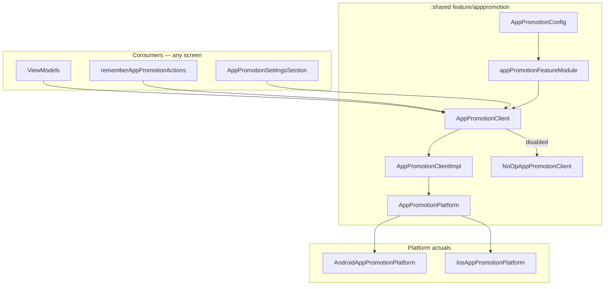

# App Promotion Feature — Design Spec

**Date:** 2026-06-26  
**Status:** Approved (brainstorming)  
**Scope:** Shared feature package `feature/apppromotion` in `:shared` for in-app rating and share-app flows; enabled by default; programmatic API + Settings action rows; trigger from any screen

---

## Summary

Add `com.devindie.cmptemplate.feature.apppromotion` under `:shared` exposing **`AppPromotionClient`** with `requestInAppReview()` and `shareApp()`. Configured once at Koin init via `appPromotionFeatureModule(AppPromotionConfig(...))` with **`enabled = true` by default**. When disabled, `NoOpAppPromotionClient` returns `Failure(NotConfigured)` — no store SDK calls.

Hosts trigger flows anywhere: inject `AppPromotionClient` in ViewModels, use `rememberAppPromotionActions()` in Compose, or rely on built-in **`AppPromotionSettingsSection`** on the Settings screen. No `:domain` or `:data` layers — platform I/O lives in `impl/platform/` via interface + Android/iOS implementations (same pattern as `feature/legal`).

---

## Requirements (decisions)

| Requirement | Decision |
|-------------|----------|
| Module shape | Feature package in `:shared` (`feature/apppromotion/`), not a Gradle module |
| v1 capabilities | In-app review (Play Review API / `SKStoreReviewController`); system share sheet with store URL |
| Default state | **Enabled by default** — wired in `appDomainModule` |
| Consumption | `AppPromotionClient` injection; `rememberAppPromotionActions()`; `AppPromotionSettingsSection()` |
| Settings | Action rows (not `SettingDefinition`) — appended in `SettingsContent` |
| Configuration | Init-time `AppPromotionConfig` — app display name, Play Store URL, App Store URL, optional share message |
| Domain/data | None — infrastructure in `:shared` only |
| Cooldown / persistence | Out of scope v1 — OS handles review quotas |
| Store fallback when review unavailable | Out of scope v1 |
| Analytics hooks | Out of scope v1 — consumers may log via `AnalyticsClient` |

---

## Approach

**Chosen:** Lightweight shared package + `AppPromotionClient` facade + platform implementations (Approach 1 from brainstorming).

**Rejected:**
- Full KMP playbook (`AppPromotionRepository` in `:domain`) — heavy for two fire-and-forget platform dialogs
- Separate Gradle module (`:apppromotion`) — user requested a shared package, always-on by default
- `ActionSettingDefinition` in settings domain — would expand settings schema; action rows as composable are simpler

---

## Architecture



### Dependency graph

```
:androidApp  → :shared, :data
:shared      → :domain, play-review (androidMain only)
:domain      → (unchanged)
:data        → (unchanged)
```

Konsist: no new layer violations. Platform imports stay in `androidMain` / `iosMain`.

---

## Public API

**Package:** `com.devindie.cmptemplate.feature.apppromotion.api`  
**Do not import** `com.devindie.cmptemplate.feature.apppromotion.impl` from host code.

### AppPromotionConfig

```kotlin
data class AppPromotionConfig(
    val enabled: Boolean = true,
    val appDisplayName: String,
    val playStoreUrl: String,
    val appStoreUrl: String,
    val shareMessage: String? = null,
) {
    fun resolvedShareMessage(): String =
        shareMessage ?: "Check out $appDisplayName!"
}
```

Store URLs are **always supplied by the host** — nothing hardcoded in `impl/`.

### AppPromotionClient

```kotlin
interface AppPromotionClient {
    /** Launch native in-app review UI (Play In-App Review / SKStoreReviewController). */
    suspend fun requestInAppReview(): AppPromotionResult

    /** Open the system share sheet with store link and share message. */
    suspend fun shareApp(): AppPromotionResult
}
```

### Results

```kotlin
sealed interface AppPromotionResult {
    data object Success : AppPromotionResult
    data class Failure(val error: AppPromotionError) : AppPromotionResult
}

enum class AppPromotionError {
    NotConfigured,
    PlatformUnavailable,
    UserCancelled,
    Unknown,
}
```

### Compose helpers

```kotlin
@Composable
fun rememberAppPromotionActions(
    client: AppPromotionClient = koinInject(),
): AppPromotionActions

class AppPromotionActions internal constructor(...) {
    fun requestInAppReview()
    fun shareApp()
}

@Composable
fun AppPromotionSettingsSection(
    modifier: Modifier = Modifier,
    client: AppPromotionClient = koinInject(),
)
```

Renders a **Support** section with two `ListItem` action rows: “Rate this app” and “Share with friends”.

### Koin

```kotlin
fun appPromotionFeatureModule(config: AppPromotionConfig): Module
```

Registered in `appDomainModule` via `includes(appPromotionFeatureModule(appPromotionConfigForTemplate()))`.

---

## Package layout

```
feature/apppromotion/
├── api/
│   AppPromotionClient.kt
│   AppPromotionConfig.kt
│   AppPromotionResult.kt
│   AppPromotionFeatureModule.kt
│   AppPromotionActions.kt          # rememberAppPromotionActions + AppPromotionActions
│   AppPromotionSettingsSection.kt
│   README.md
└── impl/
    AppPromotionClientImpl.kt
    NoOpAppPromotionClient.kt
    platform/
        AppPromotionPlatform.kt     # internal interface
        AppPromotionPlatformModule.kt  # expect fun platform bindings
```

Platform classes:

- `shared/src/androidMain/.../AndroidAppPromotionPlatform.kt`
- `shared/src/iosMain/.../IosAppPromotionPlatform.kt`
- `shared/src/androidMain/.../AppPromotionPlatformModule.android.kt`
- `shared/src/iosMain/.../AppPromotionPlatformModule.ios.kt`

App-level default config:

- `shared/src/commonMain/.../apppromotion/AppPromotionDefaults.kt` — `appPromotionConfigForTemplate()`

---

## Platform behavior

| Action | Android | iOS |
|--------|---------|-----|
| In-app review | Google Play `review` library — `ReviewManager.requestReviewFlow()` | `SKStoreReviewController.requestReview()` |
| Share | `Intent.ACTION_SEND` with `text/plain`; body = `resolvedShareMessage()` + newline + `playStoreUrl` | `UIActivityViewController` with message + `appStoreUrl` |

Android `AndroidAppPromotionPlatform` receives `Context` via Koin `androidContext()` (set in `CmpTemplateApplication`). iOS resolves the key window's root view controller for presenting the share sheet.

Review API may silently no-op when quota exceeded — still returns `Success` (OS decision).

---

## Settings integration

`SettingsContent` appends `AppPromotionSettingsSection()` after catalog sections (before optional dev panels). This is **not** a `SettingDefinition` — no DataStore persistence.

`AppSettingsCatalog` unchanged.

---

## Default configuration

```kotlin
fun appPromotionConfigForTemplate(): AppPromotionConfig =
    AppPromotionConfig(
        enabled = true,
        appDisplayName = "Cmp Template",
        playStoreUrl = "https://play.google.com/store/apps/details?id=com.devindie.cmptemplate",
        appStoreUrl = "https://apps.apple.com/app/id000000000", // replace before App Store release
    )
```

Hosts override URLs and display name for production apps.

---

## Testing

| Layer | What |
|-------|------|
| `commonTest` | `FakeAppPromotionClient`; `AppPromotionClientImpl` delegates to fake platform |
| `architecture:test` | Unchanged — no new violations |
| Manual QA | Settings → Rate / Share on Android emulator + iOS simulator |

---

## Usage examples

### ViewModel

```kotlin
class OnboardingViewModel(
    private val appPromotion: AppPromotionClient,
) : ViewModel() {
    fun onEnjoyingApp() {
        viewModelScope.launch { appPromotion.requestInAppReview() }
    }
}
```

### Compose (custom placement)

```kotlin
val actions = rememberAppPromotionActions()
TextButton(onClick = actions::requestInAppReview) { Text("Rate us") }
```

### Settings

Automatic via `AppPromotionSettingsSection` in `SettingsContent` — no extra wiring.

---

## Out of scope (v1)

- Persisted “last prompted” / custom cooldown
- Opening store listing when in-app review unavailable
- `ActionSettingDefinition` in settings domain
- Analytics events inside the feature

---

## Checklist (implementation)

- [ ] Public API types in `api/`
- [ ] `AppPromotionClientImpl` + `NoOpAppPromotionClient`
- [ ] Android Play Review + share intent
- [ ] iOS StoreKit review + `UIActivityViewController`
- [ ] `appPromotionFeatureModule` + `appPromotionConfigForTemplate()`
- [ ] `includes(...)` in `AppDomainModule`
- [ ] `AppPromotionSettingsSection` in `SettingsContent`
- [ ] `play-review` dependency in `shared` androidMain
- [ ] `feature/apppromotion/README.md`
- [ ] `./gradlew :architecture:test` green
