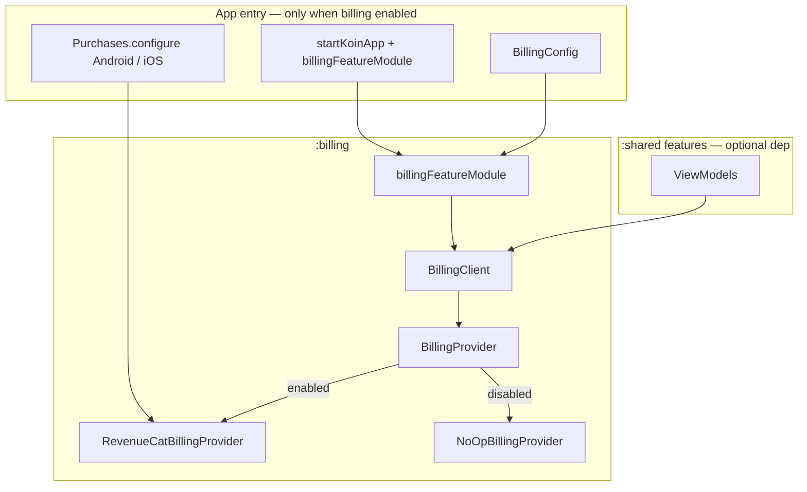

# Billing Module — Design Spec

**Date:** 2026-06-26  
**Status:** Approved (brainstorming)  
**Scope:** Standalone optional `:billing` KMP Gradle module for in-app purchases and subscriptions via RevenueCat; `BillingClient` facade; swappable `BillingProvider`; inject-and-use from ViewModels when billing is needed

---

## Summary

Add a new Gradle module `:billing` that exposes a single `BillingClient` facade, configured once at Koin init via `billingFeatureModule(BillingConfig(...))`. [RevenueCat Kotlin Multiplatform SDK](https://www.revenuecat.com/docs/getting-started/installation/kotlin-multiplatform) (`purchases-kmp-core` 3.x) is the default backend; hosts swap providers by passing a custom `BillingProvider` in config. When `enabled = false`, all calls no-op via `NoOpBillingProvider` — no RevenueCat keys, no store SDK calls. Features inject `BillingClient` directly when they opt in — no domain layer.

Unlike `:analytics`, **`:shared` does not depend on `:billing` by default**. Apps add the Gradle dependency and Koin module only when monetization is required.

---

## Requirements (decisions)

| Requirement | Decision |
|-------------|----------|
| Module shape | New Gradle module `:billing` (not packages in `:domain`/`:data`) |
| v1 capabilities | Subscriptions + one-time products; offerings; purchase; restore; entitlement observation; login/logout |
| Default backend | RevenueCat `purchases-kmp-core` 3.x |
| Swapping | Custom `BillingProvider` via `BillingConfig`; no module code changes |
| Consumption | Direct `BillingClient` injection in ViewModels |
| Configuration | Init-time — `BillingConfig(enabled = …)` + platform `Purchases.configure` |
| Optional integration | No `:shared` dep by default; wire Gradle + Koin only when needed |
| Domain/data | None — `:billing` is infrastructure; `:domain` and `:data` do not depend on it |
| Paywall UI | Out of scope v1 (`purchases-kmp-ui` deferred) |
| Native Play Billing / StoreKit-only | Out of scope v1; `BillingProvider` hook reserved |

---

## Approach

**Chosen:** Thin facade + `BillingProvider` interface + RevenueCat default (Approach 1 from brainstorming).

**Rejected:**
- Re-export RevenueCat types in public API — couples consumers to SDK
- KMP playbook `BillingRepository` in `:domain` — user chose facade-only, optional module
- Native Play Billing + StoreKit without RevenueCat — slower, more error-prone; user chose RevenueCat for speed and reliability
- `expect`/`actual` per function with no provider interface — harder to mock and swap

---

## Architecture



### Dependency graph

```
:androidApp  → :billing (when enabled), :shared, :data
:shared      → :billing (only when a feature uses BillingClient)
:billing     → purchases-kmp-core, koin, coroutines
:domain      → (unchanged — no billing)
:data        → (unchanged — no billing)
```

Konsist: `:shared` may depend on `:billing` when opted in — same category as `:analytics` (infrastructure), not `data`. `:domain` and `:data` must not import `:billing`.

---

## Public API

**Package:** `com.devindie.cmptemplate.billing.api`  
**Do not import** `com.devindie.cmptemplate.billing.impl` from app code.

### BillingClient

```kotlin
interface BillingClient {
    /** Sync customer info after Purchases.configure. Safe to call multiple times. */
    suspend fun initialize(): BillingResult<Unit>

    /** Offerings configured in RevenueCat dashboard. */
    suspend fun getOfferings(): BillingResult<BillingOfferings>

    /** Purchase a package by RevenueCat package identifier. */
    suspend fun purchase(packageId: String): BillingResult<BillingPurchase>

    /** Restore purchases (required for store policy compliance). */
    suspend fun restorePurchases(): BillingResult<BillingCustomerInfo>

    /** One-shot entitlement check from last known customer info. */
    fun isEntitled(entitlementId: String): Boolean

    /** Reactive customer info for UI gating. */
    fun observeCustomerInfo(): Flow<BillingCustomerInfo>

    /** Associate RevenueCat customer with app user id (optional). */
    suspend fun logIn(appUserId: String): BillingResult<BillingCustomerInfo>

    /** Reset to anonymous RevenueCat customer. */
    suspend fun logOut(): BillingResult<BillingCustomerInfo>
}
```

### Models (`BillingModels.kt`)

Stable, RevenueCat-agnostic types:

```kotlin
data class BillingOfferings(
    val current: BillingOffering?,
    val all: Map<String, BillingOffering>,
)

data class BillingOffering(
    val identifier: String,
    val packages: List<BillingPackage>,
)

data class BillingPackage(
    val identifier: String,
    val productId: String,
    val title: String,
    val description: String,
    val priceFormatted: String,
    val packageType: BillingPackageType,
)

enum class BillingPackageType {
    UNKNOWN,
    CUSTOM,
    LIFETIME,
    ANNUAL,
    SIX_MONTH,
    THREE_MONTH,
    TWO_MONTH,
    MONTHLY,
    WEEKLY,
}

data class BillingPurchase(
    val productId: String,
    val transactionId: String?,
    val customerInfo: BillingCustomerInfo,
)

data class BillingCustomerInfo(
    val activeEntitlements: Set<String>,
    val expirationByEntitlement: Map<String, Instant?>,
)

sealed interface BillingResult<out T> {
    data class Success<T>(val value: T) : BillingResult<T>
    data class Failure(val error: BillingError) : BillingResult<Nothing>
}

sealed class BillingError {
    data object UserCancelled : BillingError()
    data object NotConfigured : BillingError()
    data class StoreError(val message: String, val code: Int? = null) : BillingError()
    data class Unknown(val message: String) : BillingError()
}
```

Use `kotlin.time.Instant` (stdlib) for expiration timestamps — aligned with RevenueCat KMP 3.x.

### Provider contract (swappable)

```kotlin
interface BillingProvider {
    suspend fun initialize(): BillingResult<Unit>
    suspend fun getOfferings(): BillingResult<BillingOfferings>
    suspend fun purchase(packageId: String): BillingResult<BillingPurchase>
    suspend fun restorePurchases(): BillingResult<BillingCustomerInfo>
    fun observeCustomerInfo(): Flow<BillingCustomerInfo>
    suspend fun logIn(appUserId: String): BillingResult<BillingCustomerInfo>
    suspend fun logOut(): BillingResult<BillingCustomerInfo>
}
```

### Config

```kotlin
data class BillingConfig(
    val enabled: Boolean = false,
    val revenueCatApiKeyAndroid: String = "",
    val revenueCatApiKeyIos: String = "",
    val provider: BillingProvider? = null,
)
```

- `provider == null` → `RevenueCatBillingProvider` when `enabled`
- `enabled == false` → `NoOpBillingProvider` regardless of custom provider
- API keys are used by **app shell** for `Purchases.configure`, not inside `NoOp` path

### Koin module

```kotlin
fun billingFeatureModule(config: BillingConfig): Module
```

Registers `single<BillingClient> { BillingClientImpl(provider = …) }`.

Public entry delegates to internal `createBillingModule(config)` in `impl/`, mirroring `:analytics`.

---

## Internal implementation

### Module layout

```
billing/
├── build.gradle.kts
├── README.md
└── src/
    ├── commonMain/kotlin/com/devindie/cmptemplate/billing/
    │   ├── api/
    │   │   ├── BillingClient.kt
    │   │   ├── BillingConfig.kt
    │   │   ├── BillingModels.kt
    │   │   ├── BillingFeatureModule.kt
    │   │   └── provider/BillingProvider.kt
    │   └── impl/
    │       ├── BillingClientImpl.kt
    │       ├── BillingModule.kt
    │       ├── mapper/RevenueCatMappers.kt
    │       └── provider/
    │           ├── NoOpBillingProvider.kt
    │           └── RevenueCatBillingProvider.kt
    └── commonTest/kotlin/com/devindie/cmptemplate/billing/
        ├── impl/BillingClientImplTest.kt
        └── impl/provider/NoOpBillingProviderTest.kt
```

### BillingClientImpl

- Delegates all operations to injected `BillingProvider`
- Caches latest `BillingCustomerInfo` for synchronous `isEntitled`
- Merges provider `observeCustomerInfo()` emissions into cache
- Catches unexpected exceptions → `BillingResult.Failure(BillingError.Unknown)` — never throws to ViewModels
- Debug logging on failure (same pattern as `AnalyticsClientImpl`)

### NoOpBillingProvider

```kotlin
internal class NoOpBillingProvider : BillingProvider {
    // initialize → Success
    // getOfferings → Success(empty)
    // purchase / restore / logIn / logOut → Failure(NotConfigured)
    // observeCustomerInfo → flowOf(empty customer info)
    // isEntitled always false via empty entitlements
}
```

### RevenueCatBillingProvider

- Lives in `commonMain` — `purchases-kmp-core` is KMP-native (SDK 3.x handles iOS linking via Gradle)
- Assumes `Purchases.sharedInstance` is configured by app shell before `initialize()`
- Maps RevenueCat types → `Billing*` models in `RevenueCatMappers.kt`
- `purchase`: resolves package from current offerings by `packageId`; maps `PurchasesException` / user cancel → `BillingError`
- `observeCustomerInfo`: uses RevenueCat customer info listener / flow API exposed by KMP SDK
- Acknowledge / consume for one-time products handled by RevenueCat — no extra app code in v1

### RevenueCat SDK version

- **Artifact:** `com.revenuecat.purchases:purchases-kmp-core` (3.x latest stable at implementation time)
- **Not included in v1:** `purchases-kmp-ui`, `purchases-kmp-either`, `purchases-kmp-result`
- Pin version in `gradle/libs.versions.toml` as `purchases-kmp`

---

## App wiring

### Prerequisites (host responsibility)

1. [RevenueCat account](https://www.revenuecat.com/) (free tier available)
2. Android app + iOS app registered in RevenueCat dashboard
3. Products in Google Play Console + App Store Connect
4. Entitlements + Offerings configured in RevenueCat dashboard
5. Separate API keys for Android and iOS from RevenueCat project settings

### Android (`Application` — before Koin)

```kotlin
import com.revenuecat.purchases.kmp.Purchases
import com.revenuecat.purchases.kmp.PurchasesConfiguration

// In Application.onCreate(), before startKoinApp:
if (BuildConfig.BILLING_ENABLED) {
    Purchases.configure(
        PurchasesConfiguration.Builder(this, BuildConfig.REVENUECAT_API_KEY_ANDROID).build(),
    )
}

startKoinApp(
    appModules = listOf(
        // …
        billingFeatureModule(
            BillingConfig(
                enabled = BuildConfig.BILLING_ENABLED,
                revenueCatApiKeyAndroid = BuildConfig.REVENUECAT_API_KEY_ANDROID,
            ),
        ),
    ),
) { androidContext(this@CmpTemplateApplication) }
```

Store API keys in `local.properties` / CI secrets — not committed. Use placeholder empty keys when `BILLING_ENABLED = false`.

### iOS (`iOSApp.swift` + Koin — before UI)

```swift
// iOSApp.init() — before doInitKoin():
import PurchasesHybridCommon // or RevenueCat KMP configure API per SDK 3.x docs

// Purchases.configure(withAPIKey: "...")
```

```kotlin
// KoinIos.kt
billingFeatureModule(
    BillingConfig(
        enabled = true,
        revenueCatApiKeyIos = "...",
    ),
)
```

Exact iOS configure import follows RevenueCat KMP 3.x installation docs at implementation time (Gradle-managed SPM — no manual CocoaPods in v3).

### Swapping provider example (tests / future backends)

```kotlin
billingFeatureModule(
    BillingConfig(
        enabled = true,
        provider = FakeBillingProvider(), // unit tests or custom backend
    ),
)
```

---

## Optional integration checklist

Apps **without** billing:

- Do **not** add `implementation(projects.billing)` to `:shared`
- Do **not** register `billingFeatureModule` in Koin
- Do **not** call `Purchases.configure`
- Module may remain in repo (`include(":billing")`) for template users who add it later

Apps **with** billing:

- [ ] `include(":billing")` in `settings.gradle.kts`
- [ ] `implementation(projects.billing)` in `:shared` (or consuming module) + `:androidApp`
- [ ] `purchases-kmp` version in `libs.versions.toml`
- [ ] `Purchases.configure` on Android + iOS before Koin
- [ ] `billingFeatureModule(BillingConfig(enabled = true, …))` in Koin
- [ ] RevenueCat dashboard: products, entitlements, offerings
- [ ] Restore purchases entry in Settings or paywall screen (store policy)

---

## Usage examples

### ViewModel — entitlement gating

```kotlin
class PremiumViewModel(
    private val billing: BillingClient,
) : ViewModel() {
    val isPremium: StateFlow<Boolean> =
        billing
            .observeCustomerInfo()
            .map { "premium" in it.activeEntitlements }
            .stateIn(viewModelScope, SharingStarted.WhileSubscribed(5_000), false)

    fun purchaseMonthly() {
        viewModelScope.launch {
            when (val result = billing.purchase("monthly")) {
                is BillingResult.Success -> { /* UI reacts via isPremium */ }
                is BillingResult.Failure -> {
                    if (result.error !is BillingError.UserCancelled) {
                        // show error snackbar
                    }
                }
            }
        }
    }

    fun restore() {
        viewModelScope.launch {
            billing.restorePurchases()
        }
    }
}
```

### Initialize on app start (optional dedicated use case in app shell)

```kotlin
// In a startup ViewModel or Application coroutine scope:
viewModelScope.launch {
    billing.initialize()
}
```

### Link auth user

```kotlin
suspend fun onUserSignedIn(userId: String) {
    billing.logIn(userId)
}
```

---

## Gradle / project changes

### New module

| File | Purpose |
|------|---------|
| `billing/build.gradle.kts` | KMP library; `purchases-kmp-core`; koin; coroutines |
| `billing/README.md` | Integration guide (mirror `:analytics` README structure) |

### Modified (when billing is integrated into template demo)

| File | Change |
|------|--------|
| `settings.gradle.kts` | `include(":billing")` |
| `gradle/libs.versions.toml` | `purchases-kmp` version + library coordinate |
| `build.gradle.kts` | Add `:billing:allTests` to quality check if applicable |
| `architecture/...` | Document `:shared` → `:billing` as allowed when opted in |

**Not modified by default:** `shared/build.gradle.kts` — no billing dep until a feature needs it.

### API keys / secrets

- Android: `REVENUECAT_API_KEY_ANDROID` via `BuildConfig` from `local.properties`
- iOS: key in Xcode build settings or `xcconfig` — not committed
- Document placeholder keys for CI builds with `enabled = false`

---

## Testing & verification

| Test | Cases |
|------|-------|
| `BillingClientImplTest` | Delegates to fake provider; updates cache; `isEntitled` reflects cache |
| `NoOpBillingProviderTest` | `enabled = false` path; purchase returns `NotConfigured`; observe emits empty |
| Fake `BillingProvider` | Manual fake in ViewModel tests when feature integrates billing |
| `:architecture:test` | `:domain` / `:data` do not import `:billing` |

```bash
./gradlew :billing:allTests
./gradlew :architecture:test
./gradlew :billing:compileKotlinIosSimulatorArm64
./gradlew :androidApp:assembleDebug   # when billing wired to app
```

### Manual (RevenueCat sandbox)

| Check | Expected |
|-------|----------|
| `enabled = false` | App builds and runs; no `Purchases.configure`; all billing calls no-op |
| Sandbox purchase (Android) | License tester account; entitlement appears in `observeCustomerInfo` |
| Sandbox purchase (iOS) | Sandbox Apple ID; entitlement active |
| Restore | Previously purchased entitlement restored |
| User cancel purchase | `BillingResult.Failure(UserCancelled)` — no error UI |

---

## Error handling

| Scenario | Behavior |
|----------|----------|
| `Purchases` not configured | `initialize` / `purchase` → `BillingError.NotConfigured` |
| User cancels purchase flow | `BillingError.UserCancelled` |
| Store / network errors | `BillingError.StoreError` with message |
| Unexpected exceptions | `BillingError.Unknown`; logged in debug; app does not crash |
| `enabled = false` | `NoOpBillingProvider`; no RevenueCat calls |

---

## Out of scope (v1)

- `purchases-kmp-ui` paywall composable
- Server-side webhook handling (RevenueCat dashboard webhooks — host backend)
- Native-only `BillingProvider` (Play Billing + StoreKit without RevenueCat)
- Domain use cases / `BillingRepository` in `:domain`
- Sample premium screen wired into main app navigation (optional in implementation plan)
- Family sharing, promotional offers, Amazon Appstore
- Runtime toggle of billing without app restart
- Architecture test file changes beyond documenting allowed `:shared` → `:billing` dep

---

## Future extensions

- `purchases-kmp-ui` `Paywall` composable wrapper in `billing/api/compose/`
- Native `PlayBillingProvider` for teams avoiding RevenueCat vendor lock-in
- Typed `AppEntitlement` constants in feature `api/` packages
- Gradle convention plugin `cmp.billing` for one-line setup
- Settings row: "Restore purchases" + "Manage subscription" deep links
- `BillingClient.purchase(productId)` overload resolving from offerings by product id
