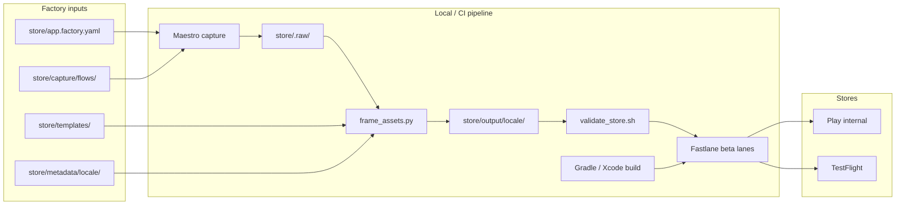

# Store Publishing Pipeline — Design Spec

**Date:** 2026-06-26  
**Status:** Implemented (v1)  
**Scope:** In-repo App Factory pipeline for Google Play and App Store listing metadata, hybrid screenshot capture, validation, and upload to **internal** (Play internal track + TestFlight). Locale-ready structure with `en-US` v1.

**User-facing guide:** [store/README.md](../../../store/README.md) — step-by-step setup and usage.

---

## Summary

Add a `store/` directory and supporting scripts, Fastlane lanes, and GitHub Actions workflows so every app generated from cmp-template can:

1. Maintain listing copy and capture recipes in git
2. Capture real UI screenshots via Maestro, post-process with branded frames and captions
3. Validate metadata and assets before upload
4. Upload signed binaries + listings to Play **internal** and **TestFlight**

A single factory contract file (`store/app.factory.yaml`) drives identity, branding, locales, and capture config. Generated apps replace placeholders during factory codegen.

---

## Requirements (decisions)

| Requirement | Decision |
|-------------|----------|
| Delivery | **In-repo pipeline** (Fastlane + scripts + GitHub Actions) |
| Scope | **App Factory** — reusable template, not one-off app |
| Visual assets | **Hybrid (C)** — Maestro capture + frame/caption post-processing |
| Release target | **Internal only v1** — Play internal track + TestFlight |
| Localization | **`en-US` content now**; `store/metadata/{locale}/` schema for later locales |
| Approach | **Factory config + Fastlane orchestration** |
| Documentation | **`store/README.md`** — prerequisites, setup, step-by-step usage, expected outputs, troubleshooting |

---

## Approach

**Chosen:** Factory config (`app.factory.yaml`) + Fastlane lanes + Maestro capture + Python framing script + `gplay validate` + GitHub Actions.

**Rejected:**
- Pure Fastlane metadata only — poor App Factory ergonomics (too many duplicated files per generated app)
- Custom CLI replacing Fastlane — reinvents deliver/supply; two systems to maintain

---

## Architecture



**Principles**

- Git is source of truth for copy and capture recipes; `store/output/` and `store/.raw/` are gitignored artifacts
- Validate before upload; CI fails fast on metadata/screenshot errors
- Template ships placeholders; factory codegen rewrites `app.factory.yaml`, package/bundle IDs, and metadata

---

## Directory layout

```
store/
├── README.md                   # Step-by-step setup and usage (primary operator doc)
├── app.factory.yaml              # Factory contract
├── metadata/
│   └── en-US/
│       ├── android/              # title.txt, short_description.txt, full_description.txt, ...
│       ├── ios/                  # name, subtitle, keywords, description, promotional_text
│       └── captions.yaml         # Per-slot screenshot captions
├── capture/
│   └── flows/
│       ├── android.yaml          # Maestro flow for screenshot sequence
│       └── ios.yaml
├── templates/
│   ├── phone_frame.png
│   ├── caption_style.yaml
│   └── feature_graphic/          # Optional Play feature graphic template
├── output/                       # gitignored — framed screenshots
└── .raw/                         # gitignored — raw captures

android/fastlane/
iosApp/fastlane/
scripts/store/
├── check-prerequisites.sh
├── frame_assets.py
├── validate_store.sh
└── sync_metadata.rb              # Optional: app.factory.yaml → fastlane paths

.github/workflows/
├── store-validate.yml
└── store-release-internal.yml
```

---

## `app.factory.yaml` schema

```yaml
app:
  displayName: "CMPTemplate"
  androidPackage: "com.devindie.cmptemplate"
  iosBundleId: "com.devindie.cmptemplate"

branding:
  primaryColor: "#6750A4"
  frameTemplate: "templates/phone_frame.png"

locales:
  default: en-US
  supported: [en-US]

capture:
  android:
    emulator: "Pixel_7_API_34"
    flow: "capture/flows/android.yaml"
  ios:
    simulator: "iPhone 16 Pro"
    flow: "capture/flows/ios.yaml"

screenshots:
  slots: 5
  devices:
    android: phone
    ios: "6.9-inch"

release:
  androidTrack: internal
  iosDestination: testflight
```

---

## Capture + post-process

1. Maestro runs `store/capture/flows/{platform}.yaml` on emulator/simulator
2. Raw PNGs → `store/.raw/{platform}/`
3. `scripts/store/frame_assets.py` applies frame template + `captions.yaml` per locale
4. Outputs → `store/output/{locale}/{platform}/` at store-required dimensions
5. Fastlane syncs outputs into supply/deliver paths before upload

**Out of scope v1:** App preview video (Phase 2).

---

## Validation gates

| Gate | Tool | When |
|------|------|------|
| Android metadata | `gplay validate listing` | PR + pre-upload |
| Android screenshots | `gplay validate screenshots` | PR + pre-upload |
| Android bundle | `gplay validate bundle` | Pre-upload |
| iOS metadata limits | `validate_store.sh` | PR |
| iOS screenshot dimensions | `validate_store.sh` | PR |

---

## CI workflows

**`store-validate.yml`** — on PR touching `store/`: metadata + screenshot spec validation (no secrets).

**`store-release-internal.yml`** — `workflow_dispatch` (+ optional `v*` tag):

1. Capture → frame → validate
2. Build signed AAB + IPA
3. Fastlane upload to Play internal + TestFlight with metadata and screenshots
4. Requires `confirm: true` input

---

## Secrets (per generated app)

| Secret | Platform |
|--------|----------|
| `GPLAY_SERVICE_ACCOUNT_JSON` | Play upload |
| `ANDROID_KEYSTORE_*` | AAB signing |
| `ASC_API_KEY_*` | TestFlight |
| `MATCH_PASSWORD` + certs repo | iOS signing |

Documented in `store/README.md`; never committed.

---

## Documentation deliverable

**Primary:** [store/README.md](../../../store/README.md)

Must include:

1. **Overview** — what the pipeline does and expected end state (internal tracks)
2. **Prerequisites** — tools to install (Ruby/Fastlane, Maestro, gplay, Python/Pillow, jq, Android SDK, Xcode on macOS)
3. **First-time setup** — Play Console, App Store Connect, service accounts, keystores, match
4. **Configure a new app** — edit `app.factory.yaml` and `metadata/en-US/`
5. **Step-by-step workflows** — validate only, capture+frame, full internal release (local + CI)
6. **Expected outputs** — file paths, dimensions, store console locations
7. **Adding locales** — new `metadata/{locale}/` folder pattern
8. **Troubleshooting** — common validation failures
9. **Implementation status** — which phases are live in the template

**Secondary:** Link from root `README.md` roadmap or modules table.

**Helper script:** `scripts/store/check-prerequisites.sh` verifies required CLIs and versions.

---

## Phased rollout

| Phase | Deliverable |
|-------|-------------|
| **1** | `store/` layout, `app.factory.yaml`, `en-US` metadata templates, **`store/README.md`**, `check-prerequisites.sh`, `store-validate.yml` |
| **2** | Maestro capture flows + `frame_assets.py` |
| **3** | Fastlane lanes (android/ios `beta`) |
| **4** | `store-release-internal.yml` |
| **Later** | Promo video, multi-locale capture, production promote, ASO tooling |

---

## App Factory integration (future)

When codegen creates a new app from cmp-template:

- Rewrite `app.factory.yaml` (name, package, bundle ID, colors)
- Replace placeholder metadata copy
- Optionally swap `templates/phone_frame.png`
- Document secrets setup in generated app's `store/README.md` checklist

---

## References

- [gplay-submission-checks skill](/.agents/skills/gplay-submission-checks/SKILL.md) — Play validation and screenshot requirements
- [app-store-review skill](/.claude/skills/app-store-review/SKILL.md) — Apple metadata limits and screenshot sets
- [ci-cd-patterns skill](/.agents/skills/ci-cd-patterns/SKILL.md) — Fastlane lane patterns
- [maestro/README.md](../../../maestro/README.md) — existing Maestro setup in this repo
