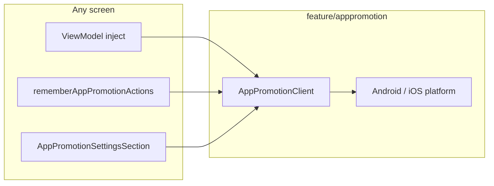

# App promotion feature

In-app **rating** and **share app** flows for cmp-template. Enabled by default via Koin; trigger from Settings or any screen.

**Design spec:** [`docs/superpowers/specs/2026-06-26-app-promotion-design.md`](../../../../../../docs/superpowers/specs/2026-06-26-app-promotion-design.md)

---

## How it fits together



| Capability | API |
|------------|-----|
| In-app review | `AppPromotionClient.requestInAppReview()` |
| Share app | `AppPromotionClient.shareApp()` |
| Compose hook | `rememberAppPromotionActions()` |
| Settings rows | `AppPromotionSettingsSection()` (wired in Settings) |
| Disable | `AppPromotionConfig(enabled = false)` |

---

## Package layout

```
feature/apppromotion/
├── api/
│   AppPromotionClient.kt
│   AppPromotionConfig.kt
│   AppPromotionFeatureModule.kt
│   AppPromotionActions.kt
│   AppPromotionSettingsSection.kt
└── impl/
    AppPromotionClientImpl.kt
    platform/          # expect/actual + Android/iOS backends
```

Default config: `shared/.../apppromotion/AppPromotionDefaults.kt`

---

## Step-by-step: trigger from your screen

### 1. ViewModel injection

```kotlin
class MyViewModel(
    private val appPromotion: AppPromotionClient,
) : ViewModel() {
    fun onRateClick() {
        viewModelScope.launch { appPromotion.requestInAppReview() }
    }
}
```

### 2. Compose without ViewModel

```kotlin
val actions = rememberAppPromotionActions()
TextButton(onClick = actions::requestInAppReview) { Text("Rate us") }
TextButton(onClick = actions::shareApp) { Text("Share") }
```

### 3. Settings

Open **Profile → Settings** — **Support** section includes **Rate this app** and **Share with friends** automatically.

---

## Configuration

Override store URLs before release:

```kotlin
appPromotionFeatureModule(
    AppPromotionConfig(
        enabled = true,
        appDisplayName = "My App",
        playStoreUrl = "https://play.google.com/store/apps/details?id=com.example.app",
        appStoreUrl = "https://apps.apple.com/app/id123456789",
        shareMessage = "Try this app!",
    ),
)
```

Template defaults live in `appPromotionConfigForTemplate()` and are registered in `AppDomainModule`.

---

## Platform notes

- **Android review** needs a foreground `Activity`; `BindAppPromotionPlatformContext()` in `App()` supplies context from Compose.
- **iOS review** uses `SKStoreReviewController` — OS may limit how often the dialog appears.
- **Share** opens the system share sheet with your configured store URL.

---

## Testing

```bash
./gradlew :shared:allTests :architecture:test
```

Use `FakeAppPromotionClient` in ViewModel tests.

---

## Checklist

- [ ] Replace placeholder App Store URL in `appPromotionConfigForTemplate()`
- [ ] Manual QA: Settings → Rate / Share on Android and iOS
- [ ] Custom screen: `rememberAppPromotionActions()` works
