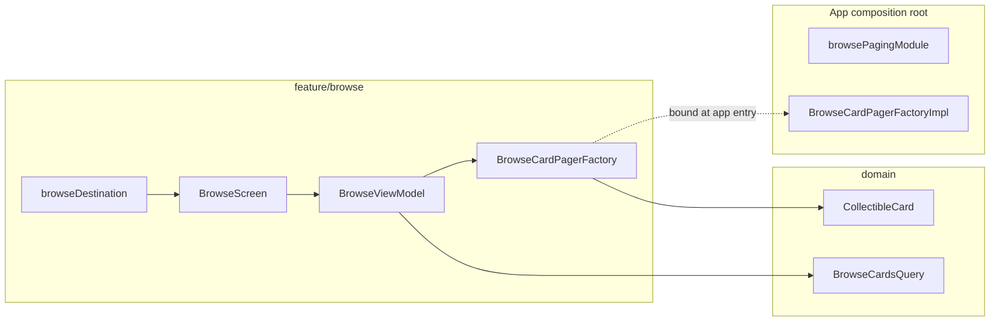

# Browse feature

Paginated catalog of collectible cards — search, category filters, pull-to-refresh, and navigation to card detail. Data comes from **Paging 3 + Room + network** via a presentation port; the feature never imports `data` types directly.

**Paging flow:** [`docs/browse-paging-flow.md`](../../../../../../docs/browse-paging-flow.md)

---

## How it fits together



| Layer | Responsibility |
|-------|----------------|
| **`feature/browse/api/`** | Navigation, `BrowseCardPagerFactory` port, `BrowseSettings`, Koin module |
| **`feature/browse/impl/`** | `BrowseScreen`, `BrowseViewModel`, list UI |
| **`domain`** | `BrowseCardsQuery`, `CollectibleCard`, `BrowseCategory` |
| **`data`** | `BrowseCardPagerFactoryImpl`, Room, remote mediator |
| **App entry** | `browsePagingModule` binds the port to the impl |

---

## Package layout

```
feature/browse/
├── api/
│   BrowseNavigation.kt       # browseDestination { ... }
│   BrowseFeatureModule.kt
│   BrowseCardPagerFactory.kt # fun interface — impl in :data
│   BrowseSettings.kt         # SettingKey + definitions for Settings
└── impl/
    BrowseScreen.kt
    BrowseViewModel.kt
    BrowseCardRow.kt
    BrowseScreenUiState.kt
```

---

## Step-by-step: use Browse in the app

### 1. Register the feature module (already done)

`browseFeatureModule` is included in `AppDomainModule`. It registers `BrowseViewModel`, which requires `BrowseCardPagerFactory`.

### 2. Bind paging at the app composition root

`BrowseCardPagerFactory` is **not** bound in `AppDomainModule`. Wire it in `androidApp` / iOS Koin bootstrap:

```kotlin
// androidApp — CmpTemplateApplication.kt
startKoin {
    modules(
        appDomainModule,
        platformDataModule(),
        browsePagingModule, // shared/androidMain or iosMain
    )
}
```

`browsePagingModule` adapts `BrowseCardPagerFactoryImpl` (from `:data`) to the `BrowseCardPagerFactory` SAM interface.

### 3. Add the destination to a NavGraph

Browse is registered as the **Browse** bottom tab via `mainTabNavGraph`:

```kotlin
import com.devindie.cmptemplate.feature.browse.api.browseDestination

fun NavGraphBuilder.mainTabNavGraph(
    onNavigateToCardDetail: (Long) -> Unit,
    // ...
) {
    browseDestination(onNavigateToCardDetail = onNavigateToCardDetail)
}
```

To pass real legal URLs (instead of the test defaults), use the overload:

```kotlin
browseDestination(
    onNavigateToCardDetail = onNavigateToCardDetail,
    privacyPolicyUrl = "https://your-domain.com/privacy",
    termsOfServiceUrl = "https://your-domain.com/terms",
)
```

### 4. Navigate to card detail

`browseDestination` calls `onNavigateToCardDetail(card.id)` when a row is tapped. The main shell wires this to `navController.navigateToCardDetail(cardId)` from `feature/carddetail/api`.

### 5. Add Browse-specific settings (optional)

See [`feature/settings/README.md`](../settings/README.md). Browse already exports `BrowseSettings.ShowPrices` — register `BrowseSettings.definitions()` in `AppSettingsCatalog` and observe the key in `BrowseViewModel` when you wire price visibility.

---

## What not to do

| Avoid | Do instead |
|-------|------------|
| Import `BrowseCardPagerFactoryImpl` in shared | Inject `BrowseCardPagerFactory` via Koin at app entry |
| Bind `BrowseCardPagerFactory` in `AppDomainModule` | `browsePagingModule` in `androidApp` / iOS |
| Put Paging / Room types in `domain` | Keep them in `data`; expose `Flow<PagingData<CollectibleCard>>` through the port |

---

## Testing

| Layer | Location |
|-------|----------|
| Paging / mediator | `data/.../browse/*Test.kt` |
| ViewModel | `shared/.../feature/browse/impl/BrowseViewModelTest.kt` (if present) |

```bash
./gradlew :shared:testAndroidHostTest --tests "*Browse*"
./gradlew :architecture:test
```

---

## Checklist for extending Browse

- [ ] Query/filter changes → update `BrowseCardsQuery` in `domain` and `BrowseViewModel`
- [ ] New setting → `BrowseSettings` + `AppSettingsCatalog` + `ObserveSettingUseCase` in ViewModel
- [ ] Paging/data changes → `data` layer only; keep `BrowseCardPagerFactory` signature stable if possible
- [ ] Manual check: open Browse tab → search → filter → tap card → detail sheet opens
