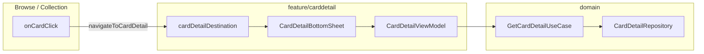

# Card detail feature

Modal bottom sheet showing a single card — image, condition selector, tiered pricing, and placeholder commerce actions. Loaded by card id through **`GetCardDetailUseCase`**; presented as a **navigation dialog** on top of the main tab graph.

---

## How it fits together



| Layer | Responsibility |
|-------|----------------|
| **`feature/carddetail/api/`** | `cardDetailDestination`, `navigateToCardDetail`, Koin module |
| **`feature/carddetail/impl/`** | Bottom sheet UI, `CardDetailViewModel` |
| **`domain`** | `CardDetail` model, `GetCardDetailUseCase` |
| **`data`** | `CardDetailRepositoryImpl`, mappers from browse entities |

---

## Package layout

```
feature/carddetail/
├── api/
│   CardDetailNavigation.kt    # dialog route + navigateToCardDetail
│   CardDetailFeatureModule.kt # viewModel { (cardId) -> ... }
└── impl/
    CardDetailBottomSheet.kt
    CardDetailScreen.kt
    CardDetailViewModel.kt
    CardDetailTopBar.kt
    CardDetailScreenUiState.kt
```

---

## Step-by-step: open card detail from your screen

### 1. Register the destination on the same NavHost as tabs

Card detail is a **dialog** destination registered alongside tab routes in `mainTabNavGraph`:

```kotlin
import com.devindie.cmptemplate.feature.carddetail.api.cardDetailDestination
import com.devindie.cmptemplate.feature.carddetail.api.navigateToCardDetail

fun NavGraphBuilder.mainTabNavGraph(
    storeName: String,
    onNavigateToCardDetail: (Long) -> Unit,
    onDismissCardDetail: () -> Unit,
    // ...
) {
    browseDestination(onNavigateToCardDetail = onNavigateToCardDetail)
    collectionDestination(onNavigateToCardDetail = onNavigateToCardDetail)
    cardDetailDestination(
        storeName = storeName,
        onDismiss = onDismissCardDetail,
    )
}
```

`MainScreen` wires navigation:

```kotlin
onNavigateToCardDetail = navController::navigateToCardDetail,
onDismissCardDetail = navController::popBackStack,
```

### 2. Navigate with a card id

From any composable with access to `NavHostController`:

```kotlin
navController.navigateToCardDetail(cardId = 42L)
```

Browse and Collection pass `onNavigateToCardDetail` into their destinations — you do not need to import card detail from list impl code if you use that callback.

### 3. ViewModel scoping

`cardDetailFeatureModule` registers a **parameterized** ViewModel:

```kotlin
viewModel { (cardId: Long) ->
    CardDetailViewModel(getCardDetail = get(), cardId = cardId)
}
```

`CardDetailBottomSheet` uses `koinViewModel { parametersOf(cardId) }` so each open gets a fresh load for that id.

### 4. Extend commerce actions

`onAddToCartClick` and `onSellYoursClick` are stubs in `CardDetailViewModel`. Wire them to domain use cases when cart/sell flows exist — keep navigation callbacks in the screen/bottom sheet, business logic in use cases.

---

## What not to do

| Avoid | Do instead |
|-------|------------|
| Import `CardDetailRepositoryImpl` in shared | `GetCardDetailUseCase` |
| Push card detail as a full-screen route without updating `MainDestination` selection | Keep it as `dialog<CardDetailRoute>` so the tab bar stays visible underneath |
| Hardcode store name in impl | Pass `storeName` into `cardDetailDestination` from `MainViewModel` state |

---

## Testing

| Layer | Location |
|-------|----------|
| Use case | `domain/.../usecase/carddetail/*Test.kt` |
| ViewModel | `shared/.../feature/carddetail/impl/CardDetailViewModelTest.kt` (if present) |

Use `FakeCardDetailRepository` from `domain` tests or `shared/.../fake/`.

```bash
./gradlew :domain:jvmTest --tests "*CardDetail*"
./gradlew :architecture:test
```

---

## Checklist

- [ ] `cardDetailDestination` on the same `NavHost` as the calling tab
- [ ] `navigateToCardDetail(id)` on row tap
- [ ] `popBackStack` (or `onDismiss`) closes the sheet
- [ ] Manual check: Browse → tap card → sheet loads → change condition → dismiss
