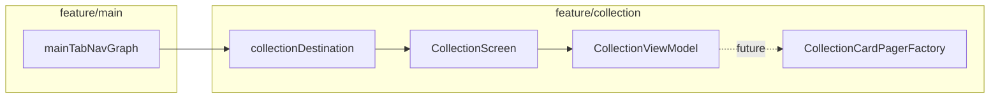

# Collection feature

Bottom-tab screen for the user's card collection. Currently a **shell** with UI scaffolding; paging is prepared via `CollectionCardPagerFactory` (same pattern as Browse) but not yet wired end-to-end.

---

## How it fits together



| Layer | Responsibility |
|-------|----------------|
| **`feature/collection/api/`** | Navigation, `CollectionCardPagerFactory` port, Koin module |
| **`feature/collection/impl/`** | `CollectionScreen`, `CollectionViewModel`, list UI |
| **`feature/main`** | Registers `collectionDestination` on the Collection tab |

---

## Package layout

```
feature/collection/
├── api/
│   CollectionNavigation.kt
│   CollectionFeatureModule.kt
│   CollectionCardPagerFactory.kt  # fun interface — mirror of Browse port
└── impl/
    CollectionScreen.kt
    CollectionViewModel.kt
    CollectionCardRow.kt
    CollectionScreenUiState.kt
```

---

## Step-by-step: use Collection in the app

### 1. Register the feature module (already done)

`collectionFeatureModule` is included in `AppDomainModule` and registers `CollectionViewModel`.

### 2. Tab destination (already wired)

`mainTabNavGraph` registers the Collection tab:

```kotlin
import com.devindie.cmptemplate.feature.collection.api.collectionDestination

collectionDestination(onNavigateToCardDetail = onNavigateToCardDetail)
```

Card taps call `onNavigateToCardDetail(card.id)` — same as Browse.

### 3. Wire paging when collection data is ready

Follow the Browse pattern:

1. Implement a pager in `:data` (or reuse/adapt `BrowseCardPagerFactoryImpl` with a collection-specific query).
2. Add a `collectionPagingModule` at the app composition root (mirror `browsePagingModule`).
3. Inject `CollectionCardPagerFactory` into `CollectionViewModel` and expose `Flow<PagingData<CollectibleCard>>`.
4. Collect with `collectAsLazyPagingItems()` in `CollectionScreen`.

Example app binding:

```kotlin
val collectionPagingModule = module {
    single<CollectionCardPagerFactory> {
        val impl = get<CollectionCardPagerFactoryImpl>()
        CollectionCardPagerFactory { query -> impl.pages(query) }
    }
}
```

### 4. Add domain + data layers for "my collection"

Per [`docs/kmp-feature-playbook.md`](../../../../../../docs/kmp-feature-playbook.md):

1. Domain model + `CollectionRepository` interface + use cases
2. `CollectionDataSource` + platform impls + `CollectionRepositoryImpl`
3. Bind repository in `platformDataModule()` at app entry
4. Register use cases in `AppDomainModule`

---

## What not to do

| Avoid | Do instead |
|-------|------------|
| Import `data` types in `CollectionViewModel` | Use cases + pager port |
| Duplicate Browse paging logic in shared | Shared factory interface; impl in `data` |
| Register collection repository in `AppDomainModule` from `:data` | `platformDataModule()` at app entry |

---

## Testing

```bash
./gradlew :architecture:test
```

Add ViewModel and repository tests as you implement collection persistence.

---

## Checklist for a full Collection implementation

- [ ] Domain: models, repository, use cases
- [ ] Data: DataSource, repository impl, pager factory impl
- [ ] `collectionPagingModule` at app entry
- [ ] `CollectionViewModel` consumes pager + settings (if any)
- [ ] Manual check: Collection tab → list loads → tap card → detail sheet
