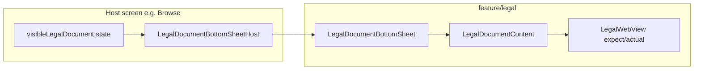

# Legal feature

Reusable **Privacy Policy** and **Terms of Service** viewer in a modal bottom sheet with an in-app WebView (platform `actual`s). URLs are **always supplied by the host** — nothing is hardcoded inside the feature.

---

## How it fits together



| Type | Purpose |
|------|---------|
| `LegalDocumentType.PrivacyPolicy` | Opens `privacyPolicyUrl` |
| `LegalDocumentType.TermsOfService` | Opens `termsOfServiceUrl` |

---

## Package layout

```
feature/legal/
├── api/
│   LegalDocumentType.kt
│   LegalDocumentBottomSheet.kt   # LegalDocumentBottomSheetHost (public)
│   LegalFeatureModule.kt         # empty — no ViewModels
└── impl/
    LegalDocumentBottomSheet.kt
    LegalDocumentContent.kt
    platform/
        LegalWebView.kt           # expect
        OpenUrlExternally.kt      # expect
```

Platform WebView implementations live under `impl/platform/` (`androidMain` / `iosMain`).

---

## Step-by-step: show a legal document

### 1. Hold visibility state in the host screen

```kotlin
var visibleLegalDocument by remember { mutableStateOf<LegalDocumentType?>(null) }

BrowseScreen(
    onPrivacyPolicyClick = { visibleLegalDocument = LegalDocumentType.PrivacyPolicy },
    onTermsOfServiceClick = { visibleLegalDocument = LegalDocumentType.TermsOfService },
)
```

### 2. Mount the host composable with URLs

```kotlin
import com.devindie.cmptemplate.feature.legal.api.LegalDocumentBottomSheetHost
import com.devindie.cmptemplate.feature.legal.api.LegalDocumentType

LegalDocumentBottomSheetHost(
    visibleDocument = visibleLegalDocument,
    privacyPolicyUrl = "https://your-domain.com/privacy",
    termsOfServiceUrl = "https://your-domain.com/terms",
    onDismiss = { visibleLegalDocument = null },
)
```

`browseDestination` in `BrowseNavigation.kt` demonstrates this pattern (with test URLs by default). Override URLs via the `browseDestination(..., privacyPolicyUrl, termsOfServiceUrl)` overload.

### 3. Use from other features

Import only `feature/legal/api` — no need to register navigation. Any screen can host `LegalDocumentBottomSheetHost` alongside its content.

### 4. DI

`legalFeatureModule` is an empty Koin module included for consistency. No bindings required unless you add ViewModels later.

---

## What not to do

| Avoid | Do instead |
|-------|------------|
| Hardcode production URLs in `impl/` | Pass URLs from app / build config / remote config |
| Open legal links only in external browser without in-app option | Use `LegalDocumentBottomSheetHost` for in-app reading; `OpenUrlExternally` for explicit external open if needed |
| Put WebView code in `api/` | Keep platform code in `impl/platform/` |

---

## Testing

- Preview: `LegalDocumentBottomSheetPreview` in `api/LegalDocumentBottomSheet.kt`
- Platform WebView: manual QA on Android and iOS simulators

```bash
./gradlew :architecture:test
```

---

## Checklist

- [ ] Host owns `LegalDocumentType?` state
- [ ] Real HTTPS URLs passed from app configuration
- [ ] `onDismiss` clears state
- [ ] Manual check: open policy → scroll → dismiss → reopen terms
