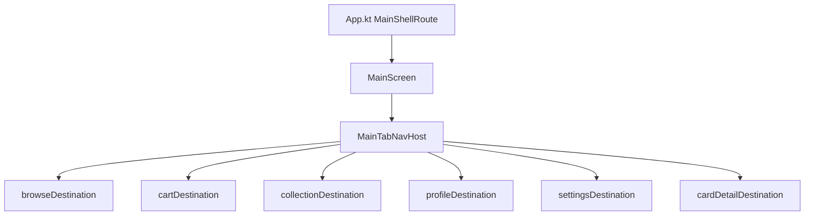

# Main feature

App shell after startup — **Scaffold** with top bar, bottom navigation, and a nested **tab NavHost** that hosts Browse, Cart, Collection, Profile, Settings, and Card detail. This package orchestrates child features; it does not own catalog or card data.

**Stitch reference:** "Empty Nav Screen" (project 17128375841121903851).

---

## How it fits together



| Piece | Role |
|-------|------|
| `MainScreen` | Owns tab `NavHostController`, bottom bar, top bar |
| `MainDestination` | Maps bottom-nav items to `MainRoute` types |
| `mainTabNavGraph` | Registers all tab + overlay destinations |
| `MainViewModel` | Shell state (e.g. `storeName`) |

---

## Package layout

```
feature/main/
├── api/
│   MainScreen.kt           # Composable entry + previewable overload
│   MainNavigation.kt       # mainTabNavGraph, MainTabNavHost, tab helpers
│   MainDestination.kt      # Bottom-nav enum
│   MainFeatureModule.kt
└── impl/
    MainViewModel.kt
    MainTopBar.kt
    BottomNavigationBar.kt
    ProfileScreen.kt
    EmptyTabContent.kt      # Cart placeholder
    MainScreenUiState.kt
```

---

## Step-by-step: use the main shell

### 1. Root navigation (already wired in `App.kt`)

After Splash / Onboarding, the app navigates to `MainShellRoute` and shows `MainScreen()`:

```kotlin
composable<MainShellRoute> {
    MainScreen()
}
```

### 2. Register the feature module (already done)

`mainFeatureModule` is in `AppDomainModule` and provides `MainViewModel`.

### 3. Add a new bottom tab

1. Add a route in `core/navigation/MainRoute.kt` (type-safe `@Serializable` route).
2. Add an entry to `MainDestination` with icons and label.
3. Add a `NavGraphBuilder` destination function (in the feature's `api/` or `main/api/` for placeholders).
4. Register it inside `mainTabNavGraph`.

Example placeholder tab (Cart today):

```kotlin
fun NavGraphBuilder.cartDestination() {
    composable<MainRoute.Cart> {
        EmptyTabContent(modifier = Modifier.fillMaxSize())
    }
}
```

### 4. Open Settings from Profile

`profileDestination` receives `onNavigateToSettings`. `MainTabNavHost` navigates to `SettingsRoute` and pops on back — see [`feature/settings/README.md`](../settings/README.md).

### 5. Wire card detail and legal URLs

`MainScreen` passes `storeName` from `MainViewModel` into `MainTabNavHost`. Browse receives legal URL parameters through `browseDestination` overloads when you customize them at the `mainTabNavGraph` call site.

### 6. Preview without DI

Use the stateless `MainScreen` overload with fake `MainScreenUiState` and a custom `tabContent` lambda — no `NavHostController` or Koin required.

---

## Tab selection behavior

`selectedMainDestination()` inspects the current and previous back stack entries so the bottom bar stays highlighted when a **dialog** (card detail) or **Settings** route is on top of a tab.

---

## What not to do

| Avoid | Do instead |
|-------|------------|
| Put feature business logic in `MainViewModel` | Feature ViewModels + domain use cases |
| Import `data` in `feature/main` | Shell only composes feature `api/` |
| Create a second root NavHost for tabs | Use nested `MainTabNavHost` inside `MainScreen` |

---

## Testing

Preview composables in `MainScreen.kt` and `BottomNavigationBar.kt`. For navigation behavior, use Compose navigation tests or manual QA across tabs.

```bash
./gradlew :architecture:test
```

---

## Checklist for a new tab

- [ ] `MainRoute` entry
- [ ] `MainDestination` enum entry + icons
- [ ] `*Destination()` in feature `api/`
- [ ] Registered in `mainTabNavGraph`
- [ ] Bottom bar highlights correctly when overlay routes open
