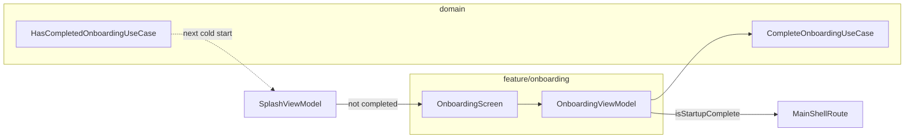

# Onboarding feature

First-run **pager** shown when the user has not completed onboarding. Pages are defined in `impl/`; completing the flow calls `CompleteOnboardingUseCase` and navigates to the main shell.

---

## How it fits together



| Step | Behavior |
|------|----------|
| Page change | Updates `currentPageIndex` |
| Next | Advances until last page |
| Get started (last page) | Persists completion → `onNavigateToMain()` |

---

## Package layout

```
feature/onboarding/
├── api/
│   OnboardingScreen.kt
│   OnboardingNavigation.kt   # OnboardingRoute
│   OnboardingFeatureModule.kt
└── impl/
    OnboardingViewModel.kt
    OnboardingContent.kt
    OnboardingPages.kt
    OnboardingScreenUiState.kt
```

---

## Step-by-step: use Onboarding in the app

### 1. Register route after Splash (already done)

```kotlin
// App.kt
composable<OnboardingRoute> {
    OnboardingScreen(
        onNavigateToMain = {
            navController.navigate(MainShellRoute) {
                popUpTo<OnboardingRoute> { inclusive = true }
            }
        },
    )
}
```

Splash navigates here when `HasCompletedOnboardingUseCase()` returns false.

### 2. Register the feature module (already done)

`onboardingFeatureModule` is in `AppDomainModule`.

### 3. Customize pages

Edit `OnboardingPages` / `OnboardingScreenUiState` in `impl/` — titles, body copy, illustrations. Keep strings localizable when you add `composeResources`.

### 4. Reset onboarding (development / settings)

Call the domain API that clears onboarding completion (whatever backs `HasCompletedOnboardingUseCase`) — then the next launch shows Onboarding again after Splash.

### 5. Preview without DI

Use the stateless `OnboardingScreen(state, ...)` overload in `@Preview` functions.

---

## What not to do

| Avoid | Do instead |
|-------|------------|
| Store onboarding flag in ViewModel only | `CompleteOnboardingUseCase` → repository / DataStore |
| Navigate from `OnboardingViewModel` | Set `isStartupComplete`; composable calls `onNavigateToMain` |
| Show onboarding on every launch | `HasCompletedOnboardingUseCase` in `SplashViewModel` |

---

## Testing

| Layer | Location |
|-------|----------|
| Use cases | `domain/.../usecase/onboarding/*Test.kt` |
| ViewModel | Fake `CompleteOnboardingUseCase`; assert `isStartupComplete` |

```bash
./gradlew :domain:jvmTest --tests "*Onboarding*"
./gradlew :architecture:test
```

---

## Checklist

- [ ] Splash routes to Onboarding when not completed
- [ ] Get started on last page persists completion
- [ ] Second launch skips Onboarding (Splash → Main)
- [ ] Manual check: swipe pages → Get started → main shell
