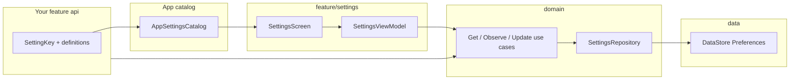

# Settings feature

Definition-driven local settings for cmp-template. Features contribute **what** appears in Settings (keys, labels, types, defaults). This package owns **persistence**, **validation**, and the **Settings UI**.

Other features read or write values through **domain use cases** — never through DataStore or this screen directly.

**Design spec:** [`docs/superpowers/specs/2026-06-25-settings-module-design.md`](../../../../../../docs/superpowers/specs/2026-06-25-settings-module-design.md)

---

## How it fits together



| Layer | Responsibility |
|-------|----------------|
| **Your feature `api/`** | `SettingKey` constants + `SettingDefinition` list |
| **`settings/` (app)** | `AppSettingsCatalog` — groups sections from features |
| **`feature/settings`** | Settings screen, rows per type, `settingsFeatureModule` |
| **`domain`** | Models, `SettingsCatalog`, use cases, `SettingsRepository` |
| **`data`** | `SettingsRepositoryImpl`, KMP DataStore |

---

## Supported setting types

| Definition type | UI control | Stored as |
|-----------------|------------|-----------|
| `BooleanSettingDefinition` | Switch | boolean |
| `TextSettingDefinition` | Text field (commit on Done) | string |
| `IntSettingDefinition` / `LongSettingDefinition` / `DoubleSettingDefinition` | Numeric field | int / long / double |
| `SingleChoiceSettingDefinition` | Dialog + radio buttons | string (option id) |
| `MultiChoiceSettingDefinition` | Dialog + checkboxes | string set |

Validation (type match, min/max, max length, valid option ids) runs in `UpdateSettingUseCase` before anything is saved.

---

## Package layout

```
feature/settings/
├── api/                    # Public entry points
│   SettingsRoute.kt
│   SettingsNavigation.kt   # settingsDestination { ... }
│   SettingsScreen.kt
│   SettingsFeatureModule.kt
└── impl/                   # Internal UI + ViewModel
    SettingsViewModel.kt
    SettingsContent.kt
    SettingsItemRow.kt
    *SettingRow.kt           # One composable per type
```

App-level catalog wiring lives outside this package:

- `shared/.../settings/AppSettings.kt` — app-owned definitions
- `shared/.../settings/AppSettingsCatalog.kt` — aggregates all sections
- `shared/.../settings/SettingsCatalogModule.kt` — Koin binding

---

## Step-by-step: add settings from your feature

### 1. Declare keys and definitions in your feature `api/`

Create a small object next to your other public API (see `feature/browse/api/BrowseSettings.kt`):

```kotlin
object MyFeatureSettings {
    val EnableNotifications = SettingKey("myfeature.notifications")

    fun definitions(): List<SettingDefinition> =
        listOf(
            BooleanSettingDefinition(
                key = EnableNotifications,
                title = "Notifications",
                description = "Show alerts for this feature",
                default = true,
            ),
        )
}
```

**Conventions**

- Use a stable, namespaced key: `"<feature>.<name>"` (e.g. `browse.show_prices`).
- Export `SettingKey` values so other classes can read the same setting without string literals.
- Definitions are **metadata only** — no callbacks. When a value changes, consumers **observe** it via use cases.

### 2. Register your section in the app catalog

Add your definitions to `AppSettingsCatalog` (or another `SettingsCatalog` implementation):

```kotlin
class AppSettingsCatalog : SettingsCatalog {
    override val sections =
        listOf(
            SettingsSection(
                id = "myfeature",
                title = "My feature",
                definitions = MyFeatureSettings.definitions(),
            ),
            // ...existing sections
        )
}
```

`settingsCatalogModule()` already binds `single<SettingsCatalog> { AppSettingsCatalog() }` in the Android app and iOS Koin entry points. You only need to extend the catalog class.

### 3. Read a setting from a ViewModel or use case caller

Inject `GetSettingUseCase` or `ObserveSettingUseCase` (registered in `AppDomainModule`):

```kotlin
class MyFeatureViewModel(
    private val observeSetting: ObserveSettingUseCase,
) : ViewModel() {
    val showNotifications: StateFlow<Boolean> =
        observeSetting(MyFeatureSettings.EnableNotifications)
            .map { value ->
                (value as? SettingValue.BooleanValue)?.value ?: true
            }
            .stateIn(viewModelScope, SharingStarted.WhileSubscribed(5_000), true)
}
```

- **Unset values** fall back to the catalog default.
- **Unknown keys** return `null` from `GetSettingUseCase` / emit `null` without a catalog entry.

### 4. Write a setting programmatically (optional)

Prefer letting the user change values on the Settings screen. If you must set a value in code:

```kotlin
updateSetting(
    MyFeatureSettings.EnableNotifications,
    SettingValue.BooleanValue(false),
) // returns Result<Unit>; failures carry SettingsError
```

### 5. Navigation (already wired in main shell)

Settings is reached from **Profile → Settings**. The main tab graph registers:

- `profileDestination(onNavigateToSettings = …)`
- `settingsDestination(onBack = …)`

To open Settings from another graph, add `settingsDestination` and navigate to `SettingsRoute`:

```kotlin
import com.devindie.cmptemplate.feature.settings.api.SettingsRoute
import com.devindie.cmptemplate.feature.settings.api.settingsDestination

fun NavGraphBuilder.myGraph(navController: NavHostController) {
    settingsDestination(onBack = { navController.popBackStack() })
}

// navigate
navController.navigate(SettingsRoute)
```

`SettingsScreen` uses `koinViewModel()` — Koin must be started (normal app entry).

---

## Definition examples by type

```kotlin
// Text
TextSettingDefinition(
    key = SettingKey("profile.nickname"),
    title = "Nickname",
    description = null,
    default = "Player",
    maxLength = 20,
)

// Single choice
SingleChoiceSettingDefinition(
    key = SettingKey("appearance.theme"),
    title = "Theme",
    description = "App color theme",
    options = listOf(
        SettingOption("system", "System"),
        SettingOption("light", "Light"),
        SettingOption("dark", "Dark"),
    ),
    defaultOptionId = "system",
)

// Multi choice
MultiChoiceSettingDefinition(
    key = SettingKey("notifications.channels"),
    title = "Alert channels",
    description = null,
    options = listOf(
        SettingOption("email", "Email"),
        SettingOption("push", "Push"),
    ),
    defaultOptionIds = setOf("push"),
)

// Number
IntSettingDefinition(
    key = SettingKey("browse.page_size"),
    title = "Page size",
    description = null,
    default = 20,
    min = 10,
    max = 50,
)
```

---

## What not to do

| Avoid | Do instead |
|-------|------------|
| Import `SettingsRepositoryImpl` or DataStore in features | `GetSettingUseCase` / `ObserveSettingUseCase` |
| Put custom composables in definitions | Add a new `SettingDefinition` variant + row in `impl/` (if truly generic) |
| Hardcode setting strings in ViewModels | `SettingKey` on your feature `api` object |
| Register `SettingsCatalog` in `AppDomainModule` | `settingsCatalogModule()` at app entry (Android / iOS) |

---

## Testing

| Layer | Location |
|-------|----------|
| Domain use cases | `domain/.../usecase/settings/*Test.kt` |
| Repository | `data/.../settings/SettingsRepositoryImplTest.kt` |
| ViewModel | `shared/.../feature/settings/impl/SettingsViewModelTest.kt` |

Use `FakeSettingsRepository` and `FakeSettingsCatalog` from `domain` tests or `shared/.../fake/` for presentation tests.

```bash
./gradlew :domain:jvmTest --tests "com.devindie.cmptemplate.domain.usecase.settings.*"
./gradlew :shared:testAndroidHostTest --tests "*SettingsViewModelTest*"
./gradlew :architecture:test
```

---

## Checklist for a new setting

- [ ] `SettingKey` + `SettingDefinition`(s) in feature `api/`
- [ ] Section added to `AppSettingsCatalog`
- [ ] Consumers use `ObserveSettingUseCase` / `GetSettingUseCase` with your key
- [ ] Domain tests for validation edge cases (if non-trivial)
- [ ] Manual check: Profile → Settings → change value → back → reopen (value persisted)
