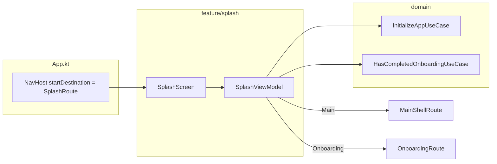

# Splash feature

First screen in the app graph. Runs **startup initialization** (minimum display time + `InitializeAppUseCase`), then routes to **Main** or **Onboarding** based on `HasCompletedOnboardingUseCase`.

---

## How it fits together



| Phase | UI |
|-------|-----|
| Loading | Spinner / branding (`SplashPhase.Loading`) |
| Error | Message + retry (`SplashPhase.Error`) |
| Success | `LaunchedEffect` navigates away (no persistent success UI) |

---

## Package layout

```
feature/splash/
├── api/
│   SplashScreen.kt
│   SplashNavigation.kt   # SplashRoute
│   SplashFeatureModule.kt
└── impl/
    SplashViewModel.kt
    SplashContent.kt
    SplashScreenUiState.kt
    SplashPhase.kt
    SplashPostStartupDestination.kt
```

---

## Step-by-step: use Splash in the app

### 1. Set as NavHost start destination (already done)

```kotlin
// App.kt
NavHost(
    navController = navController,
    startDestination = SplashRoute,
) {
    composable<SplashRoute> {
        SplashScreen(
            onNavigateToMain = {
                navController.navigate(MainShellRoute) {
                    popUpTo<SplashRoute> { inclusive = true }
                }
            },
            onNavigateToOnboarding = {
                navController.navigate(OnboardingRoute) {
                    popUpTo<SplashRoute> { inclusive = true }
                }
            },
        )
    }
}
```

### 2. Register the feature module (already done)

`splashFeatureModule` is in `AppDomainModule`.

### 3. Customize startup work

Add steps inside `InitializeAppUseCase` in `domain` — migrations, remote config, account restore, etc. `SplashViewModel` already awaits it in parallel with `MIN_DISPLAY_MS` so the splash is not a flash.

### 4. Handle errors

On failure, `SplashViewModel` sets `SplashPhase.Error`. The user taps retry → `onRetryClick()` → `runStartup()` again. Do not navigate away on error.

### 5. Android system splash (optional)

`androidApp` may call `installSplashScreen()` in `MainActivity` for the OS-level splash. That is separate from this Compose `SplashScreen` feature.

---

## What not to do

| Avoid | Do instead |
|-------|------------|
| Long blocking work in `SplashScreen` composable | `InitializeAppUseCase` in ViewModel |
| Navigate from `SplashViewModel` directly | Emit `postStartupDestination`; let composable call `onNavigateTo*` |
| Skip onboarding check in `App.kt` | Respect `SplashPostStartupDestination.Onboarding` |

---

## Testing

| Layer | Location |
|-------|----------|
| Use cases | `domain/.../usecase/startup/*`, `.../onboarding/HasCompletedOnboarding*` |
| ViewModel | Test `runStartup` success/failure with fake use cases |

```bash
./gradlew :domain:jvmTest --tests "*InitializeApp*"
./gradlew :architecture:test
```

---

## Checklist

- [ ] `SplashRoute` is `startDestination`
- [ ] `popUpTo<SplashRoute> { inclusive = true }` on forward navigation
- [ ] `InitializeAppUseCase` covers required startup side effects
- [ ] Manual check: cold start → splash → main or onboarding; airplane mode → error → retry
